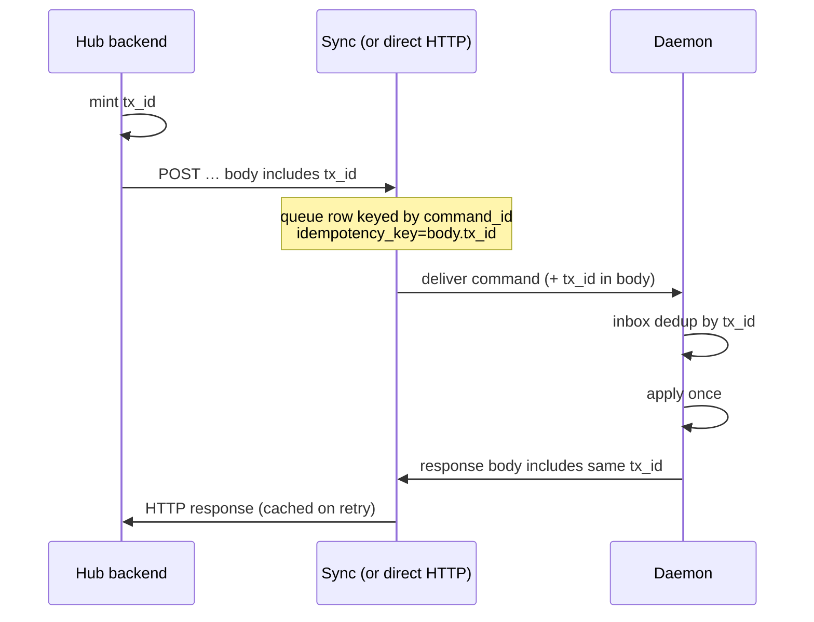

# DESIGN: Control Message Reliability

**Status:** Approved for implementation (2026-09-03)  
**Supersedes (scope expansion):** [`sync-reliability.md`](./sync-reliability.md) — that doc’s Hub→daemon relay phases are largely shipped; this design folds Elan’s gaps and a single protocol for **both directions**.  
**Repos:** `cliqhub` (backend, sync), `cliq-platform` (daemon)

---

## 1. Problem

Cross-boundary work today uses **two inconsistent protocols**:

1. **Hub → daemon (via sync relay):** queued, ack’d, redelivered, daemon SQLite dedup — mostly shipped per `sync-reliability.md`.
2. **Daemon → Hub (mirrors, events, heartbeat):** mixed fire-and-forget / best-effort / one durable log outbox.

Further gaps:

- Design assumed **only daemons** disappear; Hub and sync can also die.
- No durable **transaction id** for control hops (`command_id` is per queue insert; retries without idempotency mint a new one).
- Sync clocks **commands**; Hub does **not** clock **runs/actions** after execute accepts (zombie `running` while daemon heartbeat stays fresh).
- Sync failure modes are quieter than direct HTTP; callers rarely consume command status.

`Idempotency-Key` is already supported on the sync relay; **dispatch does not send it**.

---

## 2. Goals

1. **One control-message protocol** whether the path is sync relay or direct HTTP.
2. **`tx_id` on every state-changing control message** — request and response carry the same id; at-most-once apply, at-least-once delivery.
3. **Clear class table:** reliable control vs declared FoF (logs, most stream events, heartbeat).
4. **Either side ephemeral:** sender retains until ack or typed terminal failure; both Hub and daemon are mortal.
5. **Hub clocks actions** (run/action lease), not only daemon liveness.
6. **Domain tables stay clean** — `run_id` / `team_id`; `tx_id` lives in the transport/audit plane (optional thin link table later).

## Non-goals (v1)

- Per-log-line or per-stream-event `tx_id`.
- Putting `tx_id` columns on `team_runs`, `teams`, phases, or log rows.
- Rewriting product APIs around transactions.
- Exactly-once side effects outside our inbox/outbox (we guarantee at-most-once **apply** via dedup).

---

## 3. Two planes

| Plane | Purpose | Keys |
|-------|---------|------|
| **Transport / control audit** | Did this message land? Retries, response body | `tx_id` (+ sync `command_id`) |
| **Domain** | What is the run / team / artifact? | `run_id`, `team_id`, `scope/slug`, … |

Control payloads **reference** domain ids. They do not become domain schema.

Optional later: `run_control_events(run_id, tx_id, kind, at)` / `team_control_events(...)` if product needs long-lived “who dispatched this” after sync retention — **not** required for the protocol.

---

## 4. Message classes

| Class | Examples | Guarantee | `tx_id`? |
|-------|----------|-----------|----------|
| **Control (Hub→daemon)** | execute, cancel, supply_inputs, install, uninstall, init, assemble, unbind, offer_job, settings/set | Req/ack; durable queue; redelivery; receiver dedup | **Yes** (Hub mints) |
| **Control (daemon→Hub)** | run complete, authoritative phase terminal, install ack paths that mutate Hub | Req/ack; durable **outbox** on daemon; Hub inbox dedup | **Yes** (sender mints or continues) |
| **Bulk / FoF** | log chunks, high-volume stream events | Declared FoF **or** seq outbox keyed by `(run_id, seq)` — not per-item `tx_id` | **No** |
| **Liveness** | heartbeat | Best-effort; **must not** be the sole input to run reaping once action leases exist | **No** (v1) |

**Team sync / heartbeat team roster:** roster payload is FoF/cache warming (see `DESIGN-heartbeat-team-sync.md`). **Install / uninstall / rebind** are control messages with `tx_id`. Do not put `tx_id` on `teams` rows.

---

## 5. Envelope

```text
{
  tx_id: string,          // UUID; same on request and response
  kind: string,           // e.g. execute | cancel | run_complete | install
  producer: string,       // hub | daemon:<id> | sync
  consumer: string,
  payload: object,        // existing HTTP body fields
  attempt: number,        // 1-based delivery attempt (optional on wire)
  created_at: number      // epoch ms
}
```

**Wire mapping (v1, minimal churn):**

| Field | Where |
|-------|--------|
| `tx_id` | **JSON body field** on every control request and response (same value). Not headers. |
| Sync store | `sync_command_queue.idempotency_key = body.tx_id`; **globally unique** (not per-daemon). Responses keyed by `command_id`, lookup by `tx_id`. |
| Sync relay | Reads `tx_id` from the request **body** for idempotent queueing across **all** daemons. |

Daemon response **reuses** Hub’s `tx_id` for that hop — it does not mint a second id for the ack.

Daemon→Hub control messages: **daemon mints** a new `tx_id` per outbound control op (complete, etc.).

---

## 6. Invariants

| ID | Guarantee |
|----|-----------|
| C1 | Every **control** message reaches a terminal outcome: `acked`, `failed`, or `expired`. No silent loss. |
| C2 | At-most-once **apply** on the receiver (inbox/dedup by `tx_id`). At-least-once **delivery**. |
| C3 | Failures are observable: caller error **or** queryable status by `tx_id`. |
| C4 | Either party can disappear; the sender’s outbox/queue retains until ack or terminal failure. |
| C5 | Domain identity (`run_id`, `team_id`) is independent of `tx_id`. |
| C6 | After Hub accepts a run as started, Hub owns an **action lease**; expiry → terminal (`timed_out` / `crashed`) even if daemon heartbeat is fresh. |

Relay-specific I1–I4 from `sync-reliability.md` remain as the Hub→daemon specialization of C1–C4.

---

## 7. Sequence (Hub → daemon control)



Retry after timeout: Hub **reuses the same `tx_id`**. Sync returns cached response or attaches to in-flight waiter (already implemented when key is present).

### Same daemon vs other daemon

| Case | Who stops double-apply |
|------|-------------------------|
| Sync **redelivers** to the **same** daemon | **Daemon dedup** — inbox keyed by `body.tx_id` (fallback: sync `command_id`) |
| Hub **retries** and sync would send to a **different** daemon | **Sync/Hub: `tx_id` is globally unique** — lookup and unique index are on `idempotency_key` alone, **not** `(daemon_id, key)`. If that `tx_id` already completed or is in-flight on daemon A, Hub gets the cached/attached outcome and must **not** execute on B under the same `tx_id`. |
| Intentional **failover** to another daemon | Hub mints a **new** `tx_id`. Domain guards still apply (`run_id` already accepted, exclusive claim, install rebind, etc.). |

Daemon-local inbox alone cannot see work that landed on another machine — that is why global `tx_id` uniqueness at sync is required.

---

## 8. Hub action lease (runs)

After execute/create succeeds on Hub:

1. Run is `running` with `lease_expires_at` (or equivalent).
2. Progress acks (phase terminal mirrors, explicit lease refresh, or complete) extend the lease.
3. Lease expiry → Hub marks run timed_out/crashed **without** requiring daemon heartbeat to go stale.
4. `RunReaper` (daemon-stale HB) becomes a **secondary** safety net, not the primary action clock.

Logs/events do not refresh the lease unless explicitly classified as progress control (default: they do not).

---

## 9. Daemon → Hub control

Extend the **log outbox** pattern (`hub_log_mirror`) to state-changing Hub writes:

| Path today | Target |
|------------|--------|
| `hub_run_mirror` create/complete/phases | Durable outbox + ack; `tx_id` per message; Hub dedup |
| Notifications | Same if must land; else stay FoF and document |
| Heartbeat | FoF |
| Log chunks | Keep seq outbox; key `(run_id, seq)` not `tx_id` |

Hub apply: upsert/dedup by `tx_id` (header or body).

---

## 10. Relationship to existing docs

| Doc | Relationship |
|-----|----------------|
| `sync-reliability.md` | Relay hardening P1–P6 — **shipped**; mark superseded for *scope*, keep as implementation notes for sync service |
| `DESIGN-heartbeat-team-sync.md` | Roster cache = FoF/bulk; install/rebind = control under this design |
| Dual-run / team_id adopt fixes | Domain correctness; orthogonal to `tx_id` but required so control apply doesn’t FK-fail |

---

## 11. Implementation plan

### Phase 0 — Docs (this PR)

- [x] This design
- [x] Mark `sync-reliability.md` superseded / pointer here

### Phase 1 — Hub mints `tx_id` on every daemon control call

**Repo:** `cliqhub` backend

1. [x] `_post_to_daemon` mints UUID `tx_id` (or accepts caller-supplied for retries).
2. [x] Injects `tx_id` into the JSON **body** (not headers).
3. [x] `_post_to_daemon_with_retry` **reuses** one `tx_id` across attempts.
4. [x] Log `tx_id` on dispatch start/complete/error.
5. [x] Sync: use `body.tx_id` as `idempotency_key` for queue dedupe.
6. Optional: `GET` status by `tx_id` (join on `idempotency_key`) — nice-to-have same phase.

**Acceptance:** Retry of the same dispatch does not double-execute when sync still has the first command; logs show `tx_id`.

### Phase 2 — Daemon echoes / inbox by `tx_id` (daemon dedup)

**What “daemon dedup” means:** Sync may **redeliver** a control command to the **same** daemon (crash after apply, before ack). The daemon inbox stores `{ tx_id → cached response }` and replays without re-applying.

**What it does *not* cover:** The same `tx_id` routed to a **different** daemon — that is prevented at **sync/Hub** (global `tx_id` uniqueness). Failover uses a new `tx_id` + domain idempotency.

**Repo:** `cliq-platform` daemon

1. [x] Command poller reads `tx_id` from the command **body**.
2. [x] Prefer `tx_id` as dedup key (fallback: sync `command_id`).
3. [x] Echo `tx_id` on the response **body**.

**Acceptance:** Redelivery of same `tx_id` on the same daemon returns cached response without second apply.

**Sync (same phase):**

1. [x] Idempotency lookup / unique index on `idempotency_key` alone (drop per-daemon uniqueness).

### Phase 3 — Hub action lease

**Repo:** `cliqhub` backend (+ shared store column)

1. [x] Schema: `team_runs.lease_expires_at`
2. [x] Set on create/dispatch accept; extend on phase progress / awaiting_input / resume; clear on complete
3. [x] RunReaper expires leases independently of daemon heartbeat

**Acceptance:** Kill complete-mirror while daemon HB stays fresh → Hub still terminalizes after lease.

Env: `RUN_LEASE_TTL_MS` (default 30m), `RUN_LEASE_AWAITING_TTL_MS` (default 24h).

### Phase 4 — Daemon→Hub control outbox

**Repo:** `cliq-platform` daemon (+ Hub apply dedup)

1. Outbox for run complete / critical phase status (pattern from log mirror).
2. Mint `tx_id` per outbound control message.
3. Hub endpoints idempotent on `tx_id`.

**Acceptance:** Daemon restart mid-complete does not lose terminal Hub state; duplicate POST is no-op.

### Phase 5 — Observability + Hub/sync disappearance scenarios

1. Backend consumes sync status / failed-expired metrics on timeout.
2. Document and test: sync pod SIGTERM, response-without-waiter, PG-up/API-down.
3. Align deregister (expire) vs offline (requeue) policy in writing + tests.
4. Optional thin `*_control_events` link tables if support needs long retention.

### Phase 6 — Housekeeping

1. Env knobs from sync-reliability §8 if still desired.
2. Close or archive `sync-reliability.md` status.
3. Update OpenAPI / hub-api docs for body `tx_id` on control messages.

### Dependency graph

```text
Phase 0 (docs)
    → Phase 1 (Hub mint + headers) ──→ Phase 2 (daemon inbox by tx_id)
    → Phase 3 (action lease)          [parallel after Phase 1]
    → Phase 4 (outbound outbox)       [parallel after Phase 1]
    → Phase 5 (observability)         [after 1–2; lease helps 3]
    → Phase 6 (docs/cleanup)
```

---

## 12. Risks

| Risk | Mitigation |
|------|------------|
| Double-mint on retry if caller generates new UUID each attempt | Single mint at start of `_post_to_daemon_with_retry` / caller-held `tx_id` |
| FoF paths silently treated as control | Explicit class table; code review checklist |
| Lease too aggressive | Configurable TTL; extend on real progress only |
| Sync retention shorter than support needs | Optional control_events link table (Phase 5) |

---

## 13. Open questions (non-blocking)

1. Exact lease TTL defaults (suggest: 15–30 min idle, extend on phase terminal).
2. Whether `offer_job` shares one `tx_id` with the subsequent execute or each is separate (recommend **separate** — two control hops).
3. Notification catalog events: promote to control or keep FoF for v1 (recommend **FoF** until outbox exists).
