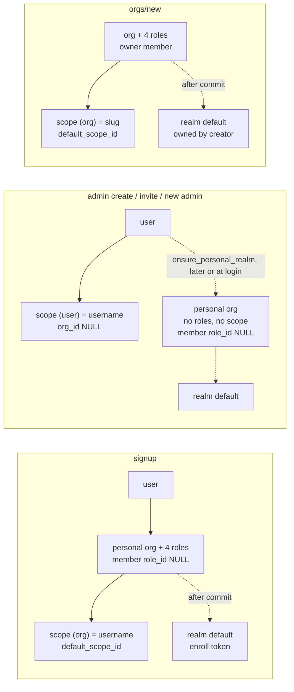

# Identity model — users, orgs, scopes, realms

Status: **Part 1 describes the code as of the "namespace fix" commit. Part 2 is PROPOSED (not implemented).**
Part 3 records the user-delete fix that follows the *current* model.

Glossary: *name* = a username, org slug or scope slug (they share one namespace,
see `src/lib/namespace.ts`). *Personal org* = an org whose slug equals a
username (that is the only thing that marks it personal today).

---

## Part 1 — Today (inventory)

### 1.1 Rows each path writes

Order is execution order. **tx** = inside one DB transaction.

#### Signup — `POST /internal/auth/signup` (`AuthService.signup`)
| # | Row | Details | tx |
|---|-----|---------|----|
| 0 | checks | `assert_namespace_free(username, user/org/scope)`, email free | – |
| 1 | `users` | username, email, hash, role `user` | tx |
| 2 | `orgs` | **personal org**: slug = display_name = username | tx |
| 3 | `org_roles` | 4 default roles (`seed_default_roles_for_org(t)`) | tx |
| 4 | `org_members` | role `admin`, `role_id` = owner role **looked up outside the tx → NULL** | tx |
| 5 | `scopes` | slug = username, **scope_type `org`**, org_id = personal org | tx |
| 6 | `scope_members` | user | tx |
| 7 | `orgs.default_scope_id` | → that scope | tx |
| 8 | `tokens` | session PAT | no |
| 9 | realm | `ensure_account_default_realm` → realm `default` in the personal org (see 1.2) | no |
| 10 | `notification_channels` | per-user in-app channel (best effort) | no |

Half-done possible: steps 8–10 after commit (user without realm until next login heals it).
Verified on Postgres: the member's `role_id` is NULL; the boot backfill later sets it to **`admin`, never `owner`**.

#### Admin user create — `POST /internal/users/new` (`UsersService.new_user`)
| # | Row | Details | tx |
|---|-----|---------|----|
| 0 | checks | `assert_namespace_free(username, user/org/scope)`, username/email free | – |
| 1 | `users` | role `user` or `admin` | tx |
| 2 | `scopes` | slug = username, **scope_type `user`, org_id NULL** | tx |
| 3 | `audit_log` | `user.create` | no |
| 4 | realm | `ensure_personal_realm` → **creates the personal org lazily** via `ensure_personal_org_for_user`: `orgs` (slug = username), `org_members` role `admin`, `role_id` NULL, **no roles, no org scope, no `default_scope_id`**; then realm `default` (1.2) | no |

Verified on Postgres: personal org with 0 roles until the next boot seeds them; member backfilled to `admin`.

#### Invite accept — `POST /v1/invitations/accept` (`InvitationsService.accept`)
New account branch (`_create_invited_user`, both org and realm invites):
| # | Row | Details | tx |
|---|-----|---------|----|
| 0 | checks | username/email free — **no org/scope namespace check** | – |
| 1 | `users` | role `user` | no |
| 2 | `scopes` | `user` scope, **only if the slug is free (silently skipped otherwise)** | no |
| 3a | org invite | `org_members` (invite role, `role_id` resolved), `ensure_org_default_realm` membership, `account_invites` accepted | no |
| 3b | realm invite | `realm_members` (invite role), `org_members` role `member` in the realm's org | no |
| 4 | realm | `ensure_personal_realm` → personal org as for admin create | no |
| 5 | `tokens` | session PAT | no |

Nothing transactional; any failure leaves a user without scope / personal org / membership.

#### Org create — `POST /v1/orgs/new`, `/internal/orgs/new` (`OrgsService.new_org`)
| # | Row | Details | tx |
|---|-----|---------|----|
| 0 | checks | slug free (org/scope/user); new admin: username ≠ slug, free of org/scope, email free | – |
| 1 | new admin only | `users` + `user` scope (org_id NULL) | tx |
| 2 | `orgs`, `org_roles` (4), `org_members` (owner role) | | tx |
| 3 | `scopes` | slug = org slug, scope_type `org`; `scope_members` admin; `orgs.default_scope_id` | tx |
| 4 | realm | `ensure_org_default_realm` → realm `default` in the org, owned by the admin | no* |
| 5 | realm | `ensure_personal_realm(admin)` → personal org (lazy, as for admin create) + its realm | no* |
| 6 | `audit_log` | `user.create` (new admin), `org.create` | no |

\* On a failure in 4–5 everything created by the call is removed again (`_undo_new_org`).

#### Realm helpers (`RealmService`)
| Helper | Writes |
|--------|--------|
| `ensure_personal_org_for_user(user, name)` | `orgs` (slug = name) **if no org has that slug — otherwise adopts the existing org**, `org_members` role `admin` (`role_id` NULL). No roles, no scope. |
| `ensure_account_default_realm` / `ensure_personal_realm` | personal org (above); realm `default` in it (`owner_user_id` = user) via `RealmService.create` → `realm_members` admin, realm in-app channel, agent-settings snapshot, built-in team list, mesh hook; realm dispatch key; default **enroll token** (`tokens` type realm); `users.default_realm_id`. Called on **every login / act-as** (`_default_realm_fields`), so it also *creates* personal orgs lazily. |
| `ensure_org_default_realm(org_slug, actor, member?)` | realm `default` in the org owned by the actor (creator); member grant; dispatch key. No enroll token. |
| `RealmService.create(user, slug, …, org_id?)` | without `org_id`: `ensure_personal_org_for_user` first. |

#### Other writers
| Path | Writes |
|------|--------|
| `orgs/add_member` | `org_members` (`member` role), org default realm membership, per-user channel |
| `account_mesh` controller, boot `migrate_org_mesh` | `ensure_personal_org_for_user` for users with mesh settings |
| boot `migrate_org_roles` | 4 roles for every org; `role_id` backfill: `admin` → **admin** role, else member (the "first admin becomes owner" in its comment is not implemented) |
| boot `migrate_namespace_orphans` | deletes orphaned user/org scopes (no teams); recreates the scope of non-personal orgs that lost it |
| `system/seed`, `lib/seed.ts` | platform scopes (`cliq`, …, scope_type `platform`); no users/orgs |

#### Deletes / suspend (before Part 3)
| Path | Did | Left behind |
|------|-----|-------------|
| `users/delete` | `DELETE users` only (FK cascades: tokens, drafts, org/scope memberships, **`audit_log` rows by that user**, invites they sent) | user scope (owner → NULL, still holding the name), personal org (no members), personal realm (`owner_user_id` dangling, slug kept), realm memberships, channels, settings |
| `users/suspend` | `suspended_at` | nothing revoked: Core's auth middleware refuses a suspended user on every request, so tokens/sessions stop working; BFF sessions stay until they fail |
| `orgs/delete` | complete since "namespace fix" (scopes, roles, members, invites, org settings/channels/keys/agents; realms soft-deleted) | — |

### 1.2 Inconsistencies

1. **Two shapes of "a user".** Signup: personal org **with** roles and an **org** scope (`default_scope_id` set). Admin create / invite / org-create-with-new-admin: a **user** scope (no org) and a personal org **without** roles (until boot), scope or `default_scope_id`.
2. **Personal orgs have no owner.** Signup leaves `role_id` NULL (role lookup outside the tx); the lazy path never sets one; the boot backfill maps `admin` → `admin`. `owner_count = 0` on most personal orgs.
3. **Personal org is created lazily on login** (`ensure_personal_realm` in `_default_realm_fields`), not at user creation.
4. **Adoption hazard**: `ensure_personal_org_for_user` adopts *any* org whose slug equals the username and adds the user as admin. Prevented for new names by the namespace checks; legacy data can still hold such pairs.
5. **Invite accept** skips the org/scope namespace check and skips the user scope when the name is taken.
6. **Transactions**: signup and org create are transactional (realms after commit); admin create is half (user+scope); invite accept not at all.
7. **Realm ownership is per user** (`owner_user_id`), also for an org's default realm (its creator), so deleting the creator leaves the org realm pointing at a missing user.
8. **"Personal" is only a naming coincidence** (org slug = username); there is no column for it.
9. Realm slugs are consistent now (`default` in the owning org); legacy `{account}.default` / `*-default` slugs are still handled in `ensure_account_default_realm`.

### 1.3 Today, as a diagram



---

## Part 2 — Clean model (PROPOSED)

### 2.1 One namespace or two?

**Recommend: keep one shared namespace** (usernames, org slugs, scope slugs).

- A team's public name is `@scope/team`. A user and an org both publish under a scope, so their names must not collide there anyway.
- A personal org is named after its user. Separate namespaces would still need "username ⇒ org slug reserved".
- URLs `/o/<org>` and `@<scope>` stay unambiguous; one uniqueness check (`lib/namespace.ts`) serves every create path.
- Separate namespaces would only pay off if users had no personal org and no personal scope. That loses the "personal workspace" every path relies on today.

Enforce it in the DB, not only in code: one `names(name PRIMARY KEY, kind, owner_id)` table written in the same transaction as the user/org/scope rows. That closes the race between two concurrent creates of the same name, which today only `UNIQUE(orgs.slug)` / `UNIQUE(scopes.slug)` / `UNIQUE(users.username)` catch, separately.

### 2.2 Ownership

| Entity | Owns (exactly) |
|--------|----------------|
| **User** | its **personal org** (slug = username, `orgs.personal_user_id = user.id`), with the user as **owner**. Everything else hangs off that org. |
| **Org** (personal or not) | the 4 roles; ≥ 1 owner member; **one org scope** (slug = org slug, `default_scope_id`); **one default realm** (`default`, owned by the org — `owner_user_id` replaced by `org_id` ownership); its other scopes (`<slug>-*`), realms, channels, settings, agents. |

A user's "personal scope" **is** the personal org's scope, so `scope_type 'user'` goes away. Personal realm = the personal org's default realm.

### 2.3 Invariants (checkable)

1. Names are unique across users, orgs and scopes (I1).
2. Every user has exactly one personal org: `orgs.personal_user_id = user.id`, slug = username (I2).
3. Every org has ≥ 1 member whose role is `owner`; the personal org's owner is its user (I3).
4. Every org has the 4 default roles; every `org_members.role_id` is set (I4).
5. Every org has exactly one scope with slug = org slug, `scope_type 'org'`, `org_id` = org, and `orgs.default_scope_id` points to it (I5).
6. Every scope belongs to an org that exists; no `user` scopes; no orphans (I6).
7. Every org has exactly one live realm `default`; `users.default_realm_id` = the personal org's default realm (I7).
8. Every realm's `org_id` exists; realm members are members of that org (I8).

`GET /internal/identity/check` (site admin), backed by SQL:
```sql
-- returns one row per violation: (invariant, subject_kind, subject_id, detail)
SELECT 'I2' AS inv, 'user' AS kind, u.id::text, u.username FROM cliq.users u
 WHERE NOT EXISTS (SELECT 1 FROM cliq.orgs o WHERE o.slug = u.username)
UNION ALL
SELECT 'I3', 'org', o.id::text, o.slug FROM cliq.orgs o
 WHERE NOT EXISTS (SELECT 1 FROM cliq.org_members m JOIN cliq.org_roles r ON r.id = m.role_id
                    WHERE m.org_id = o.id AND r.slug = 'owner')
UNION ALL
SELECT 'I4', 'org_member', m.org_id::text || '/' || m.user_id, m.role FROM cliq.org_members m WHERE m.role_id IS NULL
UNION ALL
SELECT 'I5', 'org', o.id::text, o.slug FROM cliq.orgs o
 WHERE o.default_scope_id IS NULL
    OR NOT EXISTS (SELECT 1 FROM cliq.scopes s WHERE s.id = o.default_scope_id AND s.slug = o.slug AND s.org_id = o.id)
UNION ALL
SELECT 'I6', 'scope', s.id::text, s.slug FROM cliq.scopes s
 WHERE s.scope_type <> 'platform' AND (s.org_id IS NULL OR NOT EXISTS (SELECT 1 FROM cliq.orgs o WHERE o.id = s.org_id))
UNION ALL
SELECT 'I7', 'org', o.id::text, o.slug FROM cliq.orgs o
 WHERE (SELECT count(*) FROM cliq.realms r WHERE r.org_id = o.id AND r.slug = 'default' AND NOT r.deleted) <> 1
UNION ALL
SELECT 'I1', 'name', n.name, string_agg(n.kind, ',') FROM (
    SELECT username AS name, 'user' AS kind FROM cliq.users
    UNION ALL SELECT slug, 'org' FROM cliq.orgs
    UNION ALL SELECT slug, 'scope' FROM cliq.scopes) n
 GROUP BY n.name
HAVING count(*) FILTER (WHERE kind = 'user') > 0 AND count(*) FILTER (WHERE kind = 'org') = 0;  -- a username must have its org
```

### 2.4 One function per lifecycle step (`IdentityService`, all take a transaction)

| Function | Does | Callers |
|----------|------|---------|
| `create_user_namespace(tx, {username, email, hash, role, display})` | name check (I1); user; personal org (`personal_user_id`); 4 roles; owner member; org scope + member; `default_scope_id`; **default realm rows** (realm, member, dispatch key); `default_realm_id` | signup, `users/new`, invite accept, `orgs/new` (new admin) |
| `create_org_namespace(tx, {slug, display, owner_id})` | name check; org; roles; owner; org scope; `default_scope_id`; default realm rows | `orgs/new` |
| `delete_user_namespace(tx, user_id)` | see 2.5 | `users/delete` |
| `delete_org_namespace(tx, org_id)` | see 2.5 | `orgs/delete`, `delete_user_namespace` |
| `after_commit(effects)` | best-effort side effects collected during the tx: enroll token, in-app channels, built-in team list, agent-settings snapshot, mesh, events | all of the above |

Realm creation splits into **rows** (in the tx) and **effects** (after commit, idempotent). That makes the whole namespace atomic without threading a transaction through the best-effort steps. `ensure_*` on login becomes a pure repair that only *adds* missing rows, never adopts another org.

### 2.5 Delete semantics

| Entity | Removes | Blocks (409, nothing removed) |
|--------|---------|-------------------------------|
| **User** | personal org namespace (below); memberships in other orgs, realms, scopes; tokens; drafts; per-user channels, settings, inbox; pending invites they sent; `default_realm_id` refs; BFF sessions. Keeps run/event/audit history (ids as references). | authored teams / teams in their scopes; **sole owner** of a non-personal org; personal realms with daemons, active runs or dispatch jobs; deleting yourself; protected accounts |
| **Org** | scopes (+members), roles, members, invites, org channels/rules/settings/agents/keys; realms soft-deleted (slug freed) with members, invites, settings, keys, channels; after commit: realm tokens revoked, mesh off, `realm.deleted` events | teams in its scopes; realms with daemons, active runs or dispatch jobs; a personal org on its own (deleted with its user) |

### 2.6 Rename

Renaming a name moves `@scope/team` identifiers, `/o/<org>` URLs, CLI configs and realm qualified names (`org.realm`). Proposed: **no rename of usernames or slugs**. `display_name` stays editable. If renames become necessary later, add an alias table (`name_aliases(old, new, until)`) resolved at read time, and keep the old name reserved.

### 2.7 Migration to the model (boot repair, idempotent, logged)

1. Add `orgs.personal_user_id`; set it where `orgs.slug = users.username`.
2. Every user without a personal org: create it with the full namespace (roles, owner, scope).
3. Convert `user` scopes into the personal org's scope (`scope_type 'org'`, `org_id`), set `default_scope_id`. Teams keep their `@scope` name: same slug.
4. Give every org an owner: personal org → its user; other orgs with none → the earliest `admin` (logged for review). Fill NULL `role_id`s.
5. Every org without a scope: create it (exists today for non-personal orgs).
6. Every org without a live `default` realm: create it; move realm ownership to the org.
7. Report (not fix) name collisions between a username and a *non-personal* org — they need a human.
8. Then enable `/internal/identity/check` in CI and on the admin home.

---

## Part 3 — User delete (implemented, current model)

`UsersService.delete` checks with `user_delete_blocker`, then runs `remove_user_rows` in one
transaction (both in `src/services/namespace_removal.ts`, next to `remove_org_rows`, which
`orgs/delete` and the `orgs/new` rollback also use).

- **Checks first** (409 `conflict`, nothing removed):
  - teams the user authored, or teams in a scope they own or in their personal org's scopes;
  - sole owner of another (non-personal) org. Owner = system role `owner`, or a legacy
    `owner` / `admin` row without `role_id` (signup still writes those, see 1.2);
  - other members in the personal org. It is the user's account, and deleting it would
    remove a shared org without warning. This refusal was added beyond the original ask;
  - a personal-org realm with a daemon, a run in progress or an active dispatch job
    (`RealmService.org_delete_blocker`).
  - Existing rules are kept: not yourself (422), protected usernames (422), unknown user (404).
- **Removes:**
  - the personal org (org with slug = username), exactly as `orgs/delete` does: scopes and
    their members, roles, members, org invites, org channels and rules, org agent settings,
    agents and dispatch keys. Realms are soft-deleted with their slug freed; their members,
    invites, settings, keys, custom events and channels are deleted. Users whose default
    realm was one of them are detached;
  - the user's own `user` scopes and their members;
  - org, realm (`member_type = 'user'`) and scope memberships elsewhere;
  - tokens (deleted, so revoked), drafts, account / realm agent settings, mesh settings,
    in-app notifications, and the user's own notification channel with its rules and
    subscriptions;
  - pending account and realm invites the user sent;
  - the user row;
  - a `user.delete` audit row, written in the same transaction, listing what went.
- **After commit:** realm tokens revoked, mesh off, `realm.deleted` events (best effort, logged).
- **Kept as history:** runs, events, reviews and review notifications, dispatch jobs, audit
  rows, accepted realm invites. `audit_log.admin_id` no longer cascades: the association has
  `constraints: false` and `migrate_hub_schema` drops `audit_log_admin_id_fkey` (idempotent).
  Accepted account invites the user sent still go, through the `invited_by` cascade.
- **Not touched:**
  - realms of other orgs the user created (`realms.owner_user_id` / `created_by` keep the id);
  - daemons registered by the user (`daemons.user_id`);
  - invites addressed to the user's email.
- **Suspend:** unchanged in Core. It sets `suspended_at`, and the auth middleware rejects the
  user's PATs and sessions on every request. Nothing is removed.
- **BFF:** after Core accepts `users/delete` or `users/suspend`, the BFF calls
  `SessionStore.destroy_user(user_id)`. This is best effort: a failure is logged, and Core
  already refuses the user's token. Act-as sessions held by an admin who is impersonating
  the user are keyed on the admin's id, so they stay; Core rejects their target token.
- **Tests:**
  - `tests/integration/user_delete.test.ts` (live Postgres, full app);
  - `tests/unit/services/users_service.test.ts`;
  - BFF: `tests/unit/services/users_service.test.ts` and `tests/integration/admin.test.ts`.
