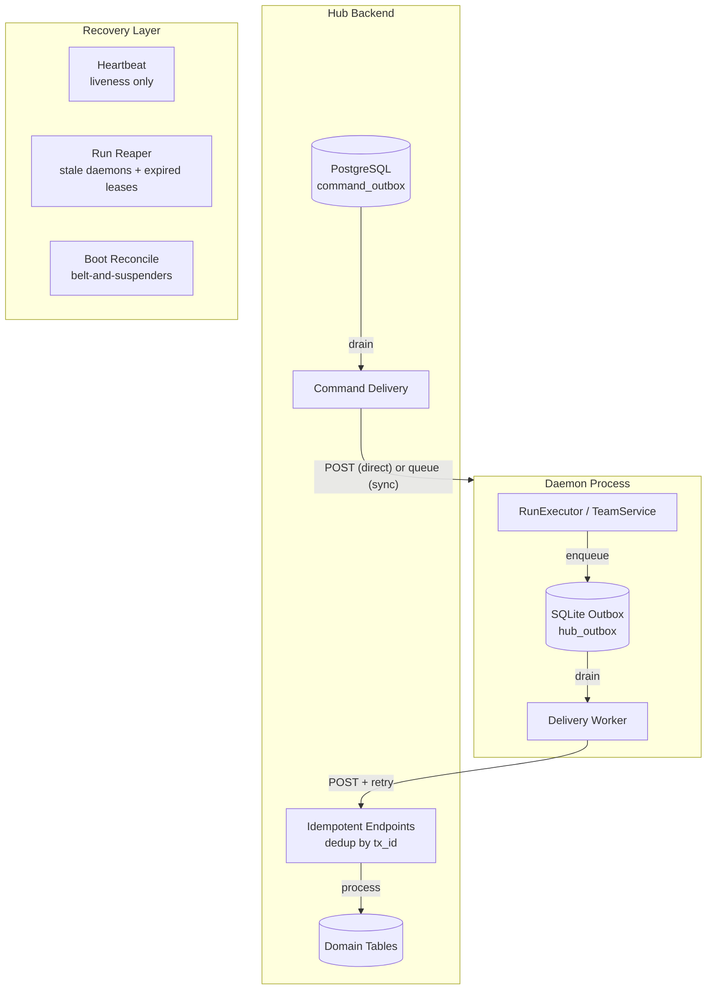
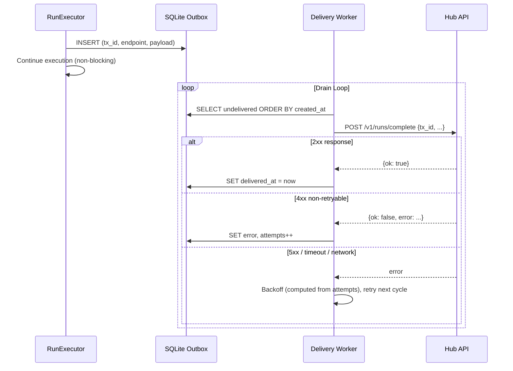
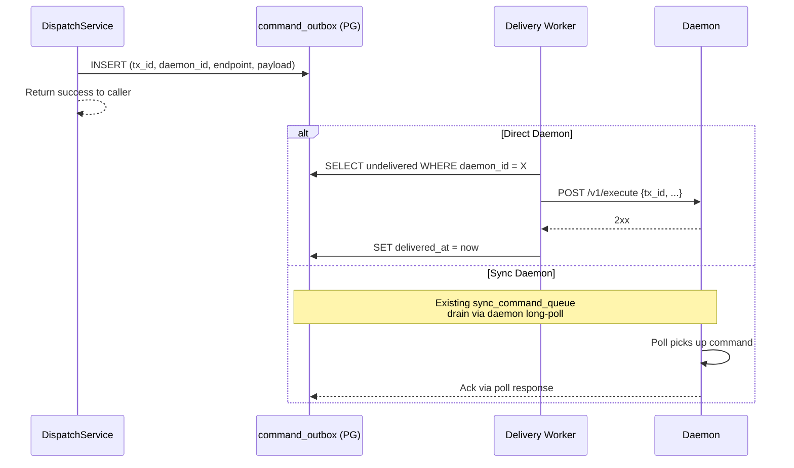
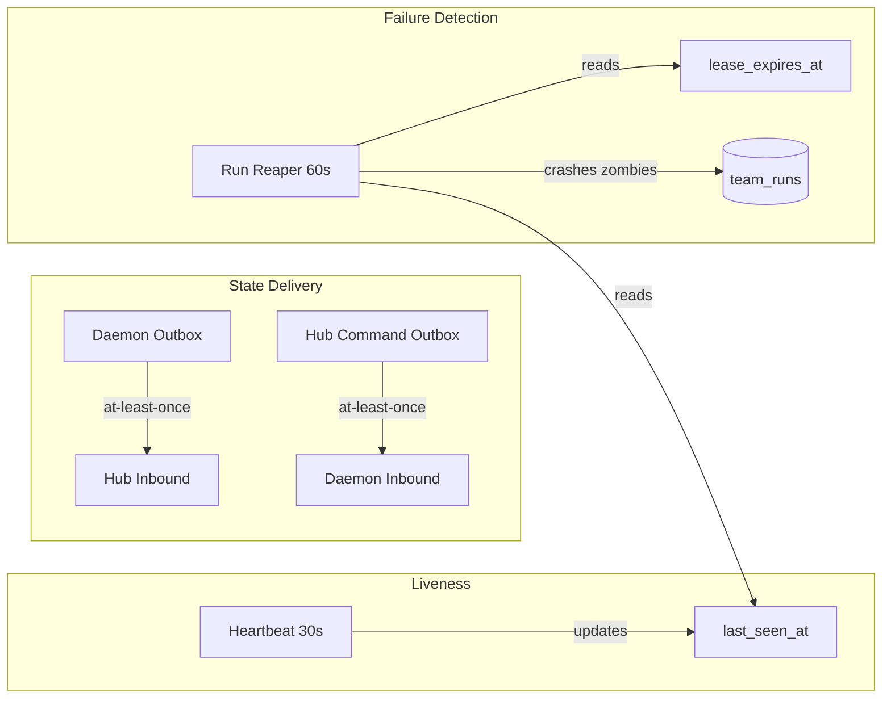
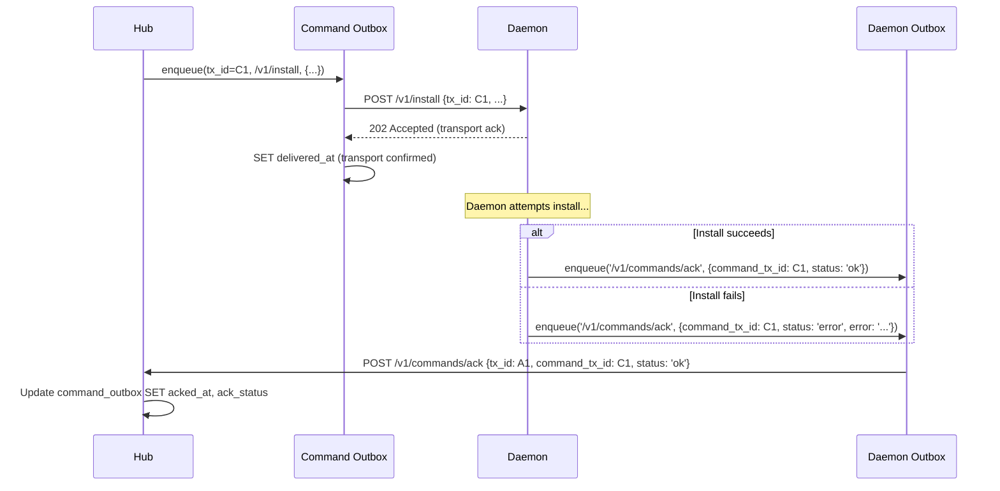
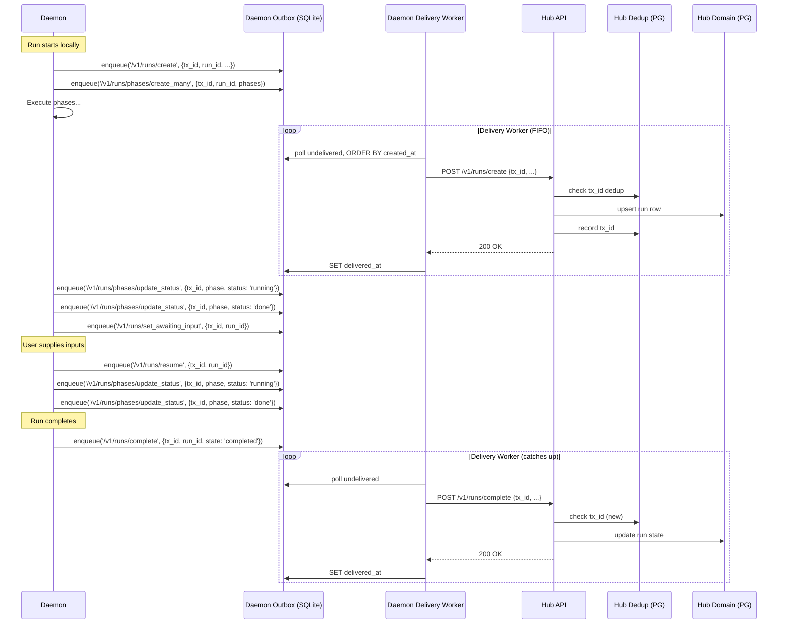
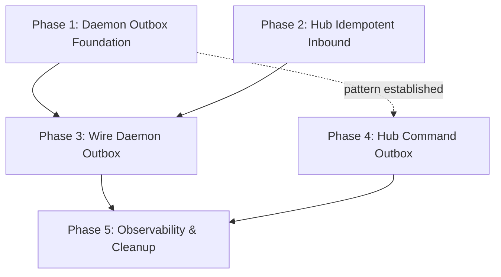

# DESIGN: Unified Outbox Sync Protocol

**Status:** Proposed  
**Date:** 2026-09-03  
**Repos:** `cliq` (daemon), `cliqhub` (backend, sync service)  
**Supersedes:** Daemon→Hub portions of [`DESIGN-control-message-reliability.md`](./DESIGN-control-message-reliability.md) Phase 4  
**Builds on:** [`sync-reliability.md`](./sync-reliability.md) (Hub→daemon relay, shipped), [`DESIGN-heartbeat-team-sync.md`](./DESIGN-heartbeat-team-sync.md)

---

## 1. Problem

The daemon↔Hub communication layer has two fundamental asymmetries that violate a core architectural principle:

> **There must be no behavioral difference between a sync-connected daemon and a directly-connected daemon. The only difference is latency of state convergence.**

### 1.1 Current State

| Direction | Direct Daemon | Sync Daemon | Durable? |
|-----------|--------------|-------------|----------|
| Hub → daemon (commands) | Inline HTTP POST | Queued via `sync_command_queue`, daemon long-polls | ✅ Sync path is durable |
| Daemon → Hub (run create) | Fire-and-forget HTTP | Fire-and-forget HTTP | ❌ |
| Daemon → Hub (run complete) | Fire-and-forget HTTP | Fire-and-forget HTTP | ❌ |
| Daemon → Hub (phase status) | Fire-and-forget HTTP | Fire-and-forget HTTP | ❌ |
| Daemon → Hub (log chunks) | Disk outbox + 8x retry | Disk outbox + 8x retry (gated on `sync_logs`) | ✅ Logs only |
| Daemon → Hub (heartbeat) | Best-effort HTTP | Best-effort HTTP | ❌ Acceptable |

Log chunks have a durable disk-backed outbox (`hub_log_mirror.ts`) with serialized per-run upload chains, retry with exponential backoff, and boot-time drain. **Every other daemon→Hub state message is fire-and-forget** — a single failed HTTP POST means the message is silently lost.

### 1.2 Consequences

1. **Run completes but Hub never learns.** `mirror_run_complete_to_hub().catch(() => {})` swallows the error. The periodic reconcile (5-min window, 10-min lookback) may catch it eventually, but runs older than 24h at boot are invisible.

2. **Run create mirror fails, then complete mirror fails.** Hub has no run row. Reconcile reports a terminal state for a run_id Hub has never seen — Hub skips it. Permanent orphan.

3. **`awaiting_input` is invisible to Hub.** No mirror call exists for this state transition. Hub thinks the run is `running`. The reaper may kill it when the lease expires, even though the run is alive and waiting for input.

4. **Phase status updates are lost.** Hub shows stale phase states. No retry, no recovery.

5. **Log outbox drain is gated on `hub_connect.sync`.** A direct daemon that crashes mid-run has pending outbox entries that are never drained on boot because `resume_hub_log_outbox()` lives inside the `if (hub_connect.sync)` block.

6. **Recovery mechanisms are ad-hoc and have coverage gaps.** Boot reconcile (24h window), periodic reconcile (5-min/10-min), phase backfill (boot-only), and the run reaper each cover a subset of failures with no unified guarantee.

### 1.3 Design Principle

The sync layer must be a **transparent transport abstraction**. Both Hub and daemon should have a single behavioral model:

- **Outbound state changes** are appended to a durable local outbox
- **A delivery worker** drains the outbox, retries with backoff, marks entries as delivered
- **Inbound endpoints** are idempotent — safe for replay
- **Recovery** is automatic: boot drains pending entries, periodic sweep catches stragglers

This is the pattern the log outbox already implements for one message type. This design generalizes it to all daemon→Hub state messages and introduces a symmetric Hub→daemon command outbox.

---

## 2. Goals

1. **At-least-once delivery** for all state-changing messages in both directions
2. **At-most-once apply** via idempotent receivers (dedup by `tx_id`)
3. **Single code path** regardless of direct vs. sync connectivity
4. **Boot recovery** — pending outbox entries drain automatically on restart
5. **FIFO ordering** — messages delivered in enqueue order; callers control sequencing
6. **Observability** — every message has a `tx_id`, delivery attempts are logged
7. **Scalability** — work proportional to activity, not fleet size; idle daemons cost zero

## Non-Goals (v1)

- Replacing the existing sync relay for Hub→daemon commands (it already works; we wrap it in an outbox)
- Per-log-line or per-stream-event `tx_id` (log outbox stays as-is, keyed by `(run_id, seq)`)
- Cross-daemon message ordering
- Schema changes to domain tables (`team_runs`, `run_phases`) — `tx_id` lives in the transport plane, never in domain tables

---

## 3. Architecture

### 3.1 Overview



### 3.2 Daemon Outbox (Daemon → Hub)



### 3.3 Hub Command Outbox (Hub → Daemon)



### 3.4 Three Independent Concerns



---

## 4. Transport Principles

### 4.1 The outbox is generic transport

The outbox knows nothing about runs, phases, teams, or any domain concept. It stores an `endpoint` (where to POST) and a `payload` (what to POST). That's it.

Domain concerns — ordering dependencies between messages, whether a stale message is still relevant, what constitutes a conflict — belong to the **caller** (enqueue side) and the **receiver** (endpoint side). The outbox delivers in FIFO order and retries on failure.

### 4.2 `tx_id` is transport-only

`tx_id` is a UUID that correlates a request with its dedup record on the receiver. It lives:
- Inside the `payload` JSON (on the wire, for the receiver to extract)
- In the `hub_outbox` / `command_outbox` row (for delivery tracking)
- In the `inbound_dedup` table on Hub (for replay detection)

It **never** appears in domain tables (`team_runs`, `team_run_phases`, `teams`, etc.). A single domain entity (e.g., a run) may be referenced by many `tx_id`s across its lifecycle. They are independent identities.

### 4.3 Wire format

There is no envelope wrapper on the wire. The HTTP body **is** the payload. `tx_id` rides inside the payload for dedup on the receiving end:

```
POST /v1/runs/complete
Content-Type: application/json
Authorization: Bearer <token>

{
  "tx_id": "a1b2c3...",
  "run_id": "r-xyz",
  "state": "completed",
  "error": null
}
```

The outbox row stores `endpoint` (the target URL path) and `payload` (the full HTTP body). The delivery worker reads both and POSTs directly — no routing logic, no abstraction layer.

### 4.4 Ordering

The outbox delivers in strict `created_at` FIFO order. If message A is enqueued before message B, A is delivered first.

If the caller needs causal ordering (e.g., `run_create` before `run_complete`), the caller is responsible for enqueuing in the correct order. Since the daemon executes runs sequentially through well-defined lifecycle stages, this is naturally satisfied — create happens before complete in the application code.

If an earlier message is stuck (retrying), later messages wait. This is correct: delivering a `run_complete` before the `run_create` would fail anyway. When the stuck message exhausts `max_attempts`, it is marked failed and the worker moves on.

### 4.5 Daemon Inbound Command Dedup

The sync path already has a dedup table (`sync_execution_log`) that prevents duplicate command execution when the sync relay redelivers. **Direct daemons have no such protection.** If the Hub command outbox retries a POST after a timeout (Hub didn't receive the 2xx but the daemon did process it), the daemon will execute the command twice — duplicate runs, duplicate installs.

**Fix:** All daemons (direct and sync) must dedup inbound commands by `tx_id` before execution:

```sql
CREATE TABLE IF NOT EXISTS command_execution_log (
    tx_id       TEXT    PRIMARY KEY,
    endpoint    TEXT    NOT NULL,
    status_code INTEGER NOT NULL,
    response    TEXT,               -- JSON; cached response for replay
    created_at  INTEGER NOT NULL    -- epoch ms; for GC
);
```

This is the same pattern as `sync_execution_log` but applied unconditionally. The sync mode's existing `sync_execution_log` is replaced by this unified table. On every inbound command:

1. Check `command_execution_log` for `tx_id`
2. If found → return cached response (idempotent replay)
3. If not found → execute, record result, return

GC: hourly, retain for 24 hours (covers any realistic retry window).

### 4.6 Execute ack semantics

The `/v1/execute` endpoint returns 200 on **acceptance** — the run record is created and the executor is kicked off asynchronously. The run may take hours to complete. The command ack for `execute` means **"accepted and started"**, not "completed." Run completion is tracked separately through the run state outbox entries (`/v1/runs/complete`).

This is consistent with all other commands where ack means "I did the thing you asked" — for `execute`, the "thing" is starting the run.

### 4.7 Stale ack detection

If the daemon crashes between receiving a command (transport 2xx) and enqueuing the `/v1/commands/ack`, Hub sees `delivered_at` set, `acked_at` null, forever. Hub needs a stale-ack detector:

- Periodic sweep of `command_outbox` where `delivered_at IS NOT NULL AND acked_at IS NULL AND delivered_at < now - threshold`
- Threshold is configurable per endpoint (e.g., 5 min for install/uninstall, 30 min for execute)
- Stale entries are marked `ack_status = 'timeout'`
- For `execute`, the run reaper already handles the zombie run — the stale ack is informational
- For `install`/`uninstall`, Hub can surface the timeout in the UI and allow retry

### 4.8 Workspace upsert consolidation

Currently `mirror_run_create_to_hub` does three sequential POSTs: workspace upsert → team link → run create. The `add_team` result isn't even checked. As separate outbox entries, a stuck upsert would block all downstream entries.

**Fix:** Fold workspace upsert and team link into Hub's `/v1/runs/create` handler. The daemon sends one outbox entry with workspace metadata included in the payload. Hub creates/upserts the workspace, links the team, and creates the run in a single transaction. This eliminates a class of ordering bugs and reduces the outbox to one entry per run create.

---

## 5. Daemon Outbox — Detailed Design

### 5.1 SQLite Schema

```sql
CREATE TABLE IF NOT EXISTS hub_outbox (
    tx_id        TEXT    PRIMARY KEY,
    endpoint     TEXT    NOT NULL,
    payload      TEXT    NOT NULL,          -- JSON; includes tx_id for receiver dedup
    attempts     INTEGER NOT NULL DEFAULT 0,
    max_attempts INTEGER NOT NULL DEFAULT 10,
    created_at   INTEGER NOT NULL,          -- epoch ms; determines delivery order
    delivered_at INTEGER,                   -- NULL = not yet delivered
    error        TEXT                       -- last failure reason; NULL = no error
);

CREATE INDEX IF NOT EXISTS idx_hub_outbox_pending
    ON hub_outbox (created_at)
    WHERE delivered_at IS NULL;
```

**Derived states** (no `status` column needed):

| State | Condition |
|-------|-----------|
| Pending | `delivered_at IS NULL AND attempts < max_attempts` |
| Delivered | `delivered_at IS NOT NULL` |
| Failed | `delivered_at IS NULL AND attempts >= max_attempts` |

### 5.2 Endpoint Mapping

The caller specifies the endpoint directly. No `kind` abstraction:

| Application Call | Endpoint | Payload |
|-----------------|----------|---------|
| Run created | `/v1/runs/create` | `{ tx_id, run_id, workspace_id, team_id, daemon_id, run_name, inputs, ... }` |
| Run completed | `/v1/runs/complete` | `{ tx_id, run_id, state, error }` |
| Phases created | `/v1/runs/phases/create_many` | `{ tx_id, run_id, phases: [{ name, agent }] }` |
| Phase status changed | `/v1/runs/phases/update_status` | `{ tx_id, run_id, phase, status }` |
| Run awaiting input | `/v1/runs/set_awaiting_input` | `{ tx_id, run_id }` |
| Run resumed | `/v1/runs/resume` | `{ tx_id, run_id }` |
| Command outcome | `/v1/commands/ack` | `{ tx_id, command_tx_id, daemon_id, status: 'ok' \| 'error', data?, error? }` |
| Notification event | `/v1/events/submit` | `{ tx_id, type, realm_id, daemon_id, run_id?, phase?, team?, title, message, payload }` |
| HUG review request | `/v1/reviews/create` | `{ tx_id, run_id, phase, review_type, ... }` |
| Batch reconcile | `/v1/runs/reconcile` | `{ tx_id, daemon_id, runs: [...] }` |

### 5.3 Enqueue API

```typescript
/**
 * Append a message to the durable outbox.
 * Returns immediately — delivery is async.
 * The payload must include a tx_id field for receiver-side dedup.
 */
function outbox_enqueue(endpoint: string, payload: Record<string, unknown>): string;
```

The function:
1. Generates a `tx_id` (UUID)
2. Injects `tx_id` into the payload
3. INSERTs a row into `hub_outbox`
4. Returns the `tx_id`

Usage in application code:

```typescript
// Before (fire-and-forget, lossy):
mirror_run_complete_to_hub(run_id, 'completed').catch(() => {});

// After (durable):
outbox_enqueue('/v1/runs/complete', { run_id, state: 'completed' });
```

### 5.4 Delivery Worker

A single async loop running on a `setInterval` (configurable, default 1000ms):

1. **Query eligible entries:**
   ```sql
   SELECT * FROM hub_outbox
   WHERE delivered_at IS NULL
     AND attempts < max_attempts
   ORDER BY created_at
   LIMIT ?
   ```

2. **Backoff check:** For each entry, compute the backoff delay from `attempts`:
   ```
   delay = min(BASE_MS * 2^attempts, MAX_BACKOFF_MS) + jitter
   eligible if: created_at + delay <= now   (first attempt)
             or: last attempt time + delay <= now
   ```
   Where `BASE_MS = 500`, `MAX_BACKOFF_MS = 60_000`, jitter = ±25%. The worker tracks the last attempt time in memory (not persisted — conservative on restart, which is fine).

3. **POST to Hub:** `POST {hub_api_url}{endpoint}` with `payload` as the JSON body. Include `Authorization: Bearer <daemon_token>`.

4. **On 2xx:** Set `delivered_at = now`.

5. **On 409 (conflict/duplicate):** Treat as delivered — the receiver already processed this `tx_id`. Set `delivered_at = now`.

6. **On 4xx (non-retryable):** Increment `attempts`, record `error`. If `attempts >= max_attempts`, the entry is effectively failed (no more retries). Specific exception: `404` is retryable (Hub may not have the referenced row yet).

7. **On 5xx / timeout / network error:** Increment `attempts`, record `error`. Next poll cycle will re-evaluate with backoff.

8. **FIFO enforcement:** If an entry fails (retryable), the worker skips all entries with `created_at` greater than the failed entry's `created_at`. This prevents out-of-order delivery. When the stuck entry is eventually delivered or exhausts `max_attempts`, later entries resume.

### 5.5 Boot Recovery

On daemon startup, after store initialization and Hub enrollment:

```typescript
async function drain_hub_outbox(): Promise<void> {
    // Start the delivery worker. It will pick up all undelivered
    // entries (delivered_at IS NULL, attempts < max_attempts) and
    // process them in created_at order. No special reset needed —
    // backoff is computed from attempts, and a fresh boot resets
    // the in-memory last-attempt tracker.
    start_outbox_worker();
}
```

This replaces:
- The ad-hoc boot-time reconciliation in `www.ts` (lines 176–204)
- The separate `resume_hub_log_outbox()` call (log outbox stays as-is for log chunks)
- The `backfill_phases_to_hub()` call (phases are now outboxed at creation time)

### 5.6 Garbage Collection

Delivered and failed entries are pruned periodically:

```sql
DELETE FROM hub_outbox
WHERE (delivered_at IS NOT NULL OR attempts >= max_attempts)
  AND created_at < ?    -- older than retention period
```

Runs on a 1-hour interval. Retention is configurable via `OUTBOX_RETENTION_DAYS` (default: 7).

### 5.7 Migration from Fire-and-Forget

The existing `hub_run_mirror.ts` functions become thin wrappers around `outbox_enqueue`:

| Current Function | New Behavior |
|-----------------|-------------|
| `mirror_run_create_to_hub(opts)` | `outbox_enqueue('/v1/runs/create', { run_id, workspace_id, ... })` |
| `mirror_run_complete_to_hub(id, state, error)` | `outbox_enqueue('/v1/runs/complete', { run_id, state, error })` |
| `mirror_phases_create_to_hub(id, phases)` | `outbox_enqueue('/v1/runs/phases/create_many', { run_id, phases })` |
| `mirror_phase_status_to_hub(id, phase, status)` | `outbox_enqueue('/v1/runs/phases/update_status', { run_id, phase, status })` |
| `await_hub_run_create(id)` | Removed — ordering is handled by outbox FIFO |
| `_create_inflight` map | Removed — no longer needed |
| `start_periodic_reconciliation()` | Kept as belt-and-suspenders, but no longer the primary recovery |

New mirrors added:

| State Transition | Outbox Call |
|-----------------|------------|
| Run enters `awaiting_input` | `outbox_enqueue('/v1/runs/set_awaiting_input', { run_id })` |
| Run resumes from `awaiting_input` | `outbox_enqueue('/v1/runs/resume', { run_id })` |
| Notification event fired | `outbox_enqueue('/v1/events/submit', { type, realm_id, ... })` |
| HUG review requested | `outbox_enqueue('/v1/reviews/create', { run_id, phase, ... })` |

---

## 6. Hub Command Outbox — Detailed Design

### 6.1 PostgreSQL Schema

```sql
CREATE TABLE IF NOT EXISTS cliq.command_outbox (
    tx_id         TEXT        PRIMARY KEY,
    daemon_id     TEXT        NOT NULL REFERENCES cliq.daemons(id),
    endpoint      TEXT        NOT NULL,
    payload       JSONB       NOT NULL,
    attempts      INTEGER     NOT NULL DEFAULT 0,
    max_attempts  INTEGER     NOT NULL DEFAULT 5,
    created_at    BIGINT      NOT NULL,
    delivered_at  BIGINT,                  -- transport confirmation (daemon received the HTTP)
    acked_at      BIGINT,                  -- app-level confirmation (daemon reports outcome)
    ack_status    TEXT,                     -- 'ok' | 'error'
    ack_data      JSONB,                   -- result payload from daemon (query responses, etc.)
    ack_error     TEXT,                     -- error detail from daemon (NULL on success)
    error         TEXT                      -- transport-level error (delivery failures)
);

CREATE INDEX IF NOT EXISTS idx_command_outbox_pending
    ON cliq.command_outbox (daemon_id, created_at)
    WHERE delivered_at IS NULL;
```

Derived states:

| State | Condition | Meaning |
|-------|-----------|---------|
| Pending | `delivered_at IS NULL AND attempts < max_attempts` | Not yet received by daemon |
| Delivered | `delivered_at IS NOT NULL AND acked_at IS NULL` | Daemon received, outcome unknown |
| Succeeded | `acked_at IS NOT NULL AND ack_status = 'ok'` | Daemon confirmed success |
| Failed (app) | `acked_at IS NOT NULL AND ack_status = 'error'` | Daemon reported failure |
| Failed (transport) | `delivered_at IS NULL AND attempts >= max_attempts` | Never reached daemon |

### 6.2 Dispatch Flow

The `DispatchService._post_to_daemon` method is replaced with outbox writes:

```typescript
// Before (inline HTTP, blocks caller):
await DispatchService._post_to_daemon_strict(daemon, '/v1/execute', body);

// After (outbox write, returns immediately):
await command_outbox_enqueue(daemon.id, '/v1/execute', body);
```

### 6.3 Delivery Adapters

The command outbox has two delivery adapters, selected per-daemon based on connectivity:

**Direct daemon** (`daemon.public_url` points to the actual daemon):
- Worker POSTs to `daemon.public_url + endpoint` with `payload` as body
- On 2xx → set `delivered_at`
- On failure → increment `attempts`, backoff, retry next cycle

**Sync daemon** (`daemon.public_url` points to sync relay):
- Command is inserted into `sync_command_queue` (existing table)
- Daemon long-polls and picks it up (existing mechanism)
- `tx_id` flows through as `idempotency_key`
- Poll response marks the `command_outbox` entry as delivered

The caller never knows which adapter is used. The outbox abstraction is the same.

### 6.4 Caller Changes

Methods that currently block on daemon HTTP become non-blocking:

| Method | Current | New |
|--------|---------|-----|
| `dispatch_run` | `_post_to_daemon_strict` (blocks) | Outbox enqueue + return `run_id` |
| `install_team` | `_post_to_daemon_with_retry` (blocks) | Outbox enqueue (retry is built in) |
| `uninstall_team` | `_post_to_daemon` (blocks) | Outbox enqueue |
| `cancel_run` | `_post_to_daemon_strict` (blocks) | Outbox enqueue |
| `supply_inputs` | `_post_to_daemon_strict` (blocks) | Outbox enqueue |
| `query_daemon` (workspaces) | `_post_to_daemon` (blocks, RPC) | Outbox enqueue; result returned via command ack payload |
| `query_daemon` (teams) | `_post_to_daemon` (blocks, RPC) | Outbox enqueue; result returned via command ack payload |
| `push_verdict_to_daemon` | Raw `fetch` in `HugReviewsService` (bypasses DispatchService) | Outbox enqueue |

**Important:** For `dispatch_run`, the Hub run row is created **before** enqueuing the execute command. This means Hub always knows about the run, even if the daemon never receives the execute. The run lease handles cleanup if the daemon never starts.

**Note:** `push_verdict_to_daemon` currently uses a raw `fetch()` that bypasses `DispatchService` entirely — no `tx_id`, no dispatch JWT, no retry. It must be migrated to `command_outbox_enqueue`.

### 6.5 Command Acknowledgment (App-Level Confirmation)

Transport-level delivery (`delivered_at` set on the command outbox) means the daemon *received* the command — not that it succeeded. The daemon must report the **outcome** of every command back to Hub through its own outbox.

**Flow:**



**Command outbox states become three-phase:**

| State | Condition | Meaning |
|-------|-----------|---------|
| Pending | `delivered_at IS NULL` | Command not yet received by daemon |
| Delivered | `delivered_at IS NOT NULL AND acked_at IS NULL` | Daemon received command, outcome unknown |
| Succeeded | `acked_at IS NOT NULL AND ack_status = 'ok'` | Daemon confirmed success |
| Failed | `acked_at IS NOT NULL AND ack_status = 'error'` | Daemon reported failure |

This requires two additional columns on `command_outbox`:

```sql
ALTER TABLE cliq.command_outbox ADD COLUMN acked_at BIGINT;
ALTER TABLE cliq.command_outbox ADD COLUMN ack_status TEXT;  -- 'ok' | 'error'
ALTER TABLE cliq.command_outbox ADD COLUMN ack_data JSONB;   -- result payload (query responses, etc.)
ALTER TABLE cliq.command_outbox ADD COLUMN ack_error TEXT;    -- error detail from daemon
```

**Daemon side:** Every command handler (install, uninstall, execute, cancel, supply_inputs) wraps its work in a try/catch and enqueues a `/v1/commands/ack` message with the original `tx_id` as `command_tx_id`:

```typescript
// In daemon command handler:
async function handle_install(body: InstallPayload): Promise<void> {
    const { tx_id, ...install_params } = body;
    try {
        await team_service.install(install_params);
        outbox_enqueue('/v1/commands/ack', {
            command_tx_id: tx_id,
            daemon_id,
            status: 'ok',
        });
    } catch (err) {
        outbox_enqueue('/v1/commands/ack', {
            command_tx_id: tx_id,
            daemon_id,
            status: 'error',
            error: (err as Error).message,
        });
    }
}
```

**Hub side:** `POST /v1/commands/ack` looks up the `command_outbox` row by `command_tx_id` and sets `acked_at`, `ack_status`, `ack_error`. This endpoint is idempotent (re-ack is a no-op) and wrapped in `with_dedup`.

**UI impact:** Hub can now show command status accurately — "pending", "delivered", "succeeded", or "failed with: {error}" — instead of assuming success after transport delivery.

---

## 7. Hub Idempotent Inbound Endpoints

Every daemon→Hub endpoint must be safe for replay. Hub deduplicates by `tx_id`.

### 7.1 Dedup Table

```sql
CREATE TABLE IF NOT EXISTS cliq.inbound_dedup (
    tx_id       TEXT    PRIMARY KEY,
    endpoint    TEXT    NOT NULL,
    status_code INTEGER NOT NULL,
    response    JSONB,
    created_at  BIGINT  NOT NULL
);

CREATE INDEX IF NOT EXISTS idx_inbound_dedup_created
    ON cliq.inbound_dedup (created_at);
```

### 7.2 Endpoint Contracts

| Endpoint | Idempotency Rule |
|----------|-----------------|
| `POST /v1/runs/create` | If `tx_id` in dedup table → return cached response. If `run_id` exists → upsert (existing behavior). |
| `POST /v1/runs/complete` | If `tx_id` in dedup table → return cached response. If run already terminal → return `{ ok: true }` (no-op). |
| `POST /v1/runs/set_awaiting_input` | If run already `awaiting_input` → no-op. Extends lease. |
| `POST /v1/runs/resume` | If run already `running` → no-op. Extends lease. |
| `POST /v1/runs/phases/create_many` | Existing `findOrCreate` is already idempotent. |
| `POST /v1/runs/phases/update_status` | Accept if status is a valid transition or same state. Refresh lease. |
| `POST /v1/commands/ack` | Look up `command_outbox` by `command_tx_id`. Set `acked_at`, `ack_status`, `ack_data`, `ack_error`. If already acked → no-op. For query commands, `ack_data` carries the result payload. |
| `POST /v1/events/submit` | If `tx_id` in dedup table → return cached response. Otherwise process event and fan out to channels. |
| `POST /v1/reviews/create` | If `tx_id` in dedup table → return cached response. If review already exists for same `run_id + phase + review_type` → return existing. |
| `POST /v1/runs/reconcile` | Already idempotent by design. |

### 7.3 Dedup Middleware

A reusable middleware wraps inbound control endpoints:

```typescript
async function with_dedup(
    tx_id: string,
    endpoint: string,
    handler: () => Promise<{ status: number; body: unknown }>,
): Promise<{ status: number; body: unknown }> {
    // Check dedup table
    const existing = await InboundDedup.findByPk(tx_id);
    if (existing) {
        return { status: existing.status_code, body: existing.response };
    }

    // Execute handler
    const result = await handler();

    // Record result (best-effort — if this fails, next retry will re-execute
    // but the handler is itself idempotent, so this is safe)
    await InboundDedup.create({
        tx_id,
        endpoint,
        status_code: result.status,
        response: result.body,
        created_at: Date.now(),
    }).catch(() => {});

    return result;
}
```

`tx_id` is required on all inbound control endpoints. Requests without `tx_id` are rejected with 400.

### 7.4 Dedup Garbage Collection

```sql
DELETE FROM cliq.inbound_dedup WHERE created_at < ?
```

Runs on the same hourly schedule as the daemon outbox GC. Retention: 7 days (configurable).

---

## 8. Heartbeat — Simplified to Pure Liveness

The heartbeat becomes a **pure liveness signal**:

```json
{
    "daemon_id": "..."
}
```

- **No team roster.** The `teams` array and `teams_hash` field are removed. Hub is the authority on what's installed — teams are installed via Hub commands delivered through the command outbox (Phase 4). The previous roster sync (`DaemonTeamCacheService.sync`) was a read-only cache with no authority behind it: locally installed teams had no realm scoping, no permission enforcement, and couldn't be dispatched through Hub's normal flow. Local-only installs remain a dev/debug convenience, not a Hub-visible production path.
- **No state digest.** Run/phase state is delivered durably through the outbox.
- **30-second interval**, best-effort. Failure is acceptable — the reaper uses `last_heartbeat` for failure detection, not state convergence.

### 8.1 Deprecation of Team Roster Sync

| Item | Change |
|------|--------|
| `teams` field in heartbeat payload | Removed from daemon sender and Hub schema |
| `teams_hash` field in heartbeat payload | Removed (was declared in schema but never actually sent) |
| `DaemonTeamCacheService.sync()` | Removed |
| `DESIGN-heartbeat-team-sync.md` | Superseded by command outbox for install/uninstall |

---

## 9. Recovery Mechanisms — Belt and Suspenders

With the outbox as the primary delivery mechanism, existing recovery becomes a safety net:

| Mechanism | Role | Change |
|-----------|------|--------|
| **Daemon outbox** | Primary delivery | **New** — replaces all fire-and-forget mirrors |
| **Boot reconcile** | Catch entries that exhausted max attempts or were in a corrupted outbox | **Simplified** — reads local terminal runs vs. outbox delivered set |
| **Periodic reconcile** | Catch edge cases (outbox GC'd before delivery) | **Kept** — runs every 5min, same as today, but rarely finds anything |
| **Run reaper** | Catch dead daemons | **Unchanged** — reaps runs on daemons that stopped heartbeating or whose lease expired |
| **Phase backfill** | N/A | **Removed** — phases are outboxed at creation time |
| **Log outbox** | Log chunk delivery | **Unchanged** — stays separate (high-volume, different ordering needs) |

### 9.1 Boot Reconcile — Revised

On boot, after starting the outbox worker:

```typescript
async function boot_reconcile(): Promise<void> {
    // Safety sweep: any local terminal runs not in outbox and not
    // confirmed delivered? Enqueue a reconcile batch.
    const local_terminal = await RunRepository.list_all_terminal(daemon_id);
    const outboxed_run_ids = await get_outboxed_run_ids();

    const missing = local_terminal.filter(
        (r) => !outboxed_run_ids.has(r.run_id),
    );

    if (missing.length > 0) {
        outbox_enqueue('/v1/runs/reconcile', {
            daemon_id,
            runs: missing.map((r) => ({
                run_id: r.run_id,
                state: r.state,
                completed_at: r.completed_at,
                error: r.error,
            })),
        });
    }
}
```

No more 24-hour window. All local terminal runs are reconciled.

---

## 10. Log Outbox — Integration

The existing `hub_log_mirror.ts` log outbox is **not replaced**. It remains a separate system because:

1. **Volume**: log chunks are high-frequency (every few seconds per run). The state outbox handles ~5 messages per run lifecycle.
2. **Ordering**: log chunks need per-run sequence ordering. State messages need causal ordering. Different models.
3. **Failure mode**: a lost log chunk is an annoyance; a lost run completion is a correctness bug. Different retry budgets.

**Changes to log outbox:**

1. **Remove `sync_logs` gate on boot drain.** `resume_hub_log_outbox()` should run on boot regardless of `hub_connect.sync` — direct daemons that crashed also have pending log entries.

2. **Remove `await_hub_run_create` dependency.** The state outbox guarantees `run_create` is delivered before log chunks need the FK. The log outbox delivery worker can check `hub_outbox` for an undelivered entry targeting `/v1/runs/create` for the same `run_id` and wait for it to be marked delivered before uploading chunks.

---

## 11. Message Flow — Complete Lifecycle



---

## 12. Configuration

### 12.1 Daemon Environment

| Env Var | Default | Purpose |
|---------|---------|---------|
| `OUTBOX_POLL_INTERVAL_MS` | `1000` | How often the delivery worker polls the outbox |
| `OUTBOX_BATCH_SIZE` | `20` | Max entries per poll cycle |
| `OUTBOX_BASE_BACKOFF_MS` | `500` | Initial retry delay |
| `OUTBOX_MAX_BACKOFF_MS` | `60000` | Maximum retry delay |
| `OUTBOX_MAX_ATTEMPTS` | `10` | Attempts before giving up |
| `OUTBOX_RETENTION_DAYS` | `7` | Days to keep delivered/failed entries |

### 12.2 Hub Environment

| Env Var | Default | Purpose |
|---------|---------|---------|
| `COMMAND_OUTBOX_POLL_INTERVAL_MS` | `2000` | Command delivery worker poll interval |
| `COMMAND_OUTBOX_BATCH_SIZE` | `50` | Max commands per poll cycle |
| `COMMAND_OUTBOX_MAX_ATTEMPTS` | `5` | Attempts before giving up |
| `INBOUND_DEDUP_RETENTION_DAYS` | `7` | Days to keep dedup entries |
| `RUN_REAPER_INTERVAL_MS` | `60000` | Reaper scan interval (unchanged) |
| `DAEMON_STALE_THRESHOLD_MS` | `90000` | Heartbeat stale threshold (unchanged) |

---

## 13. File Changes

### 13.1 Daemon (`cliq` repo)

| File | Change |
|------|--------|
| `daemon/src/core/store/boot.ts` | Add `hub_outbox` table migration |
| `daemon/src/core/service/hub_outbox.ts` | **New** — outbox enqueue, delivery worker, boot drain, GC |
| `daemon/src/core/service/hub_run_mirror.ts` | Rewrite to thin wrappers around `outbox_enqueue` |
| `daemon/src/core/service/hub_log_mirror.ts` | Remove `sync_logs` gate on `resume_hub_log_outbox`; add outbox-aware `run_create` wait |
| `daemon/src/core/service/command_ack.ts` | **New** — `ack_command()` helper; enqueues `/v1/commands/ack` to daemon outbox |
| `daemon/src/core/service/notification.service.ts` | Rewrite `emit_catalog_event` to enqueue via outbox instead of inline `fetch` |
| `daemon/src/core/service/run_executor.ts` | Wire `awaiting_input`, `resume`, and HUG review create through outbox |
| `daemon/src/core/service/run_dispatch.ts` | Ensure all run state transitions go through outbox |
| `daemon/src/core/controller/execute.controller.ts` | Wire command ack into execute handler |
| `daemon/src/core/bff/client.ts` | Remove `mirror_run_complete_to_hub().catch(() => {})` pattern; call outbox |
| `daemon/src/bin/www.ts` | Replace ad-hoc boot reconcile with `drain_hub_outbox()` + `boot_reconcile()`; remove `sync_logs` gate on log outbox resume |
| `daemon/src/core/bff/client.ts` | Remove `_build_team_roster()` and team roster from `_hub_heartbeat()`; heartbeat sends only `{ daemon_id }` |
| `daemon/tests/spec/service/hub_outbox.spec.ts` | **New** — unit tests for outbox |
| `daemon/tests/spec/service/hub_run_mirror.spec.ts` | Update for new outbox-backed implementation |

### 13.2 Hub Backend (`cliqhub` repo)

| File | Change |
|------|--------|
| `services/backend/src/core_api/db/schema_migrations.ts` | Add `command_outbox` and `inbound_dedup` tables |
| `services/backend/src/core_api/services/command_outbox.service.ts` | **New** — command outbox enqueue, delivery worker (direct + sync adapters) |
| `services/backend/src/core_api/middleware/inbound_dedup.ts` | **New** — dedup middleware for daemon→Hub endpoints |
| `services/backend/src/core_api/services/dispatch.service.ts` | Replace `_post_to_daemon*` with `command_outbox_enqueue`; callers become non-blocking |
| `services/backend/src/core_api/services/run.service.ts` | Add `set_awaiting_input` and `resume` endpoints; fold workspace upsert + team link into `create`; ensure `create` and `complete` work with dedup middleware |
| `services/backend/src/core_api/services/hug_reviews.service.ts` | Migrate `push_verdict_to_daemon` from raw `fetch` to `command_outbox_enqueue`; wrap `create` with dedup |
| `services/backend/src/core_api/routes.ts` | Add `/v1/runs/set_awaiting_input`, `/v1/runs/resume`, `/v1/commands/ack`; wrap existing endpoints with dedup middleware |
| `services/backend/src/core_api/services/run_reaper.service.ts` | Unchanged — continues as safety net |
| `services/backend/src/server.ts` | Start command outbox delivery worker on boot |
| `services/backend/tests/unit/command_outbox.service.test.ts` | **New** — unit tests for command outbox |
| `services/backend/tests/unit/inbound_dedup.test.ts` | **New** — unit tests for dedup middleware |
| `services/backend/tests/unit/run.service.test.ts` | Add tests for `set_awaiting_input`, `resume`, idempotent `complete` |

---

## 14. Implementation Plan

### Phase 1: Daemon Outbox Foundation

**Scope:** Daemon outbox table + enqueue API + delivery worker + GC. No behavioral change yet — existing fire-and-forget mirrors continue alongside.

**Goal:** A fully tested, generic outbox module that can deliver any message to Hub with at-least-once semantics.

| # | Task | Detail | File(s) | Tests |
|---|------|--------|---------|-------|
| 1.1 | SQLite schema migration | Add `hub_outbox` table with `tx_id`, `endpoint`, `payload`, `attempts`, `max_attempts`, `created_at`, `delivered_at`, `error`. Create partial index on `created_at WHERE delivered_at IS NULL`. | `store/boot.ts` | Boot test: table exists; re-boot: migration is idempotent |
| 1.2 | `outbox_enqueue()` | Generate UUID `tx_id`, inject into payload, INSERT row. Return `tx_id`. Validate `endpoint` is a non-empty string and `payload` is serializable. | `hub_outbox.ts` | Unit: row created with correct fields; `tx_id` present in payload; rejects invalid input |
| 1.3 | `hub_base_and_token()` helper | Extract Hub URL + daemon token resolution from existing `hub_run_mirror.ts` into a shared helper. Delivery worker and log mirror both use it. | `hub_outbox.ts` or shared `hub_auth.ts` | Unit: returns credentials when enrolled; returns null when not enrolled |
| 1.4 | Delivery worker — happy path | `setInterval` loop. Query undelivered entries ordered by `created_at`. For each: POST `payload` to `hub_url + endpoint`. On 2xx: set `delivered_at`. On 409: set `delivered_at` (dedup success). | `hub_outbox.ts` | Unit (mocked fetch): entry delivered, `delivered_at` set; 409 treated as success |
| 1.5 | Delivery worker — retryable errors | On 5xx, timeout, network error: increment `attempts`, set `error`. On 404: also retryable (Hub may not have the referenced row yet). | `hub_outbox.ts` | Unit: attempts incremented; error recorded; entry stays undelivered |
| 1.6 | Delivery worker — non-retryable errors | On 400, 401, 403 (except 404): increment `attempts`, set `error`. Entry will fail permanently once `attempts >= max_attempts`. | `hub_outbox.ts` | Unit: 400 → attempts incremented; after max_attempts, entry no longer picked up |
| 1.7 | Delivery worker — backoff | Compute delay from `attempts`: `min(BASE * 2^attempts, MAX) + jitter(±25%)`. Track last attempt time per `tx_id` in memory. Skip entries whose backoff hasn't elapsed. | `hub_outbox.ts` | Unit: first attempt is immediate; second waits BASE_MS; delay doubles; caps at MAX; jitter within bounds |
| 1.8 | Delivery worker — FIFO enforcement | If an entry fails (retryable), skip all entries with later `created_at` in the same poll cycle. Next cycle re-evaluates from the stuck entry. | `hub_outbox.ts` | Integration: enqueue A, B. A fails → B not attempted. A succeeds next cycle → B attempted. |
| 1.9 | Delivery worker — max attempts exhausted | When `attempts >= max_attempts`, entry is no longer eligible. Worker logs a warning and moves to the next eligible entry (FIFO resumes past the permanently failed entry). | `hub_outbox.ts` | Unit: entry with attempts=max_attempts is skipped; later entries proceed |
| 1.10 | Boot drain | `start_outbox_worker()` called on daemon boot. Worker immediately begins draining any undelivered entries from a previous daemon lifetime. | `hub_outbox.ts` | Integration: enqueue entries, stop worker, restart worker → entries delivered |
| 1.11 | Garbage collection | Hourly timer. Delete entries where `(delivered_at IS NOT NULL OR attempts >= max_attempts) AND created_at < now - retention`. | `hub_outbox.ts` | Unit: old delivered entries pruned; old failed entries pruned; recent entries kept |
| 1.12 | `start_outbox_worker` / `stop_outbox_worker` | Lifecycle functions. `stop` clears the interval and GC timer. Idempotent. | `hub_outbox.ts` | Unit: start is idempotent; stop clears timers |
| 1.13 | Structured logging | Log on: enqueue (debug), delivery attempt (debug), delivery success (info), delivery failure (warn), max attempts exhausted (error), GC (debug). Include `tx_id` and `endpoint` in all log lines. | `hub_outbox.ts` | Log format spot-check in integration tests |

### Phase 2: Hub Idempotent Inbound

**Scope:** Hub-side dedup table + middleware + new endpoints. Prerequisite for daemon outbox going live.

**Goal:** Every daemon→Hub control endpoint is safe for replay. `tx_id` is required on all requests.

| # | Task | Detail | File(s) | Tests |
|---|------|--------|---------|-------|
| 2.1 | PG schema migration: `inbound_dedup` | `tx_id TEXT PRIMARY KEY`, `endpoint TEXT`, `status_code INTEGER`, `response JSONB`, `created_at BIGINT`. Index on `created_at`. | `schema_migrations.ts` | Migration test: table exists; re-run is idempotent |
| 2.2 | `with_dedup` middleware | Extract `tx_id` from request body (required — reject 400 if absent). Check `inbound_dedup`. If hit: return cached `{ status_code, response }`. If miss: execute handler, record result in `inbound_dedup`, return result. | `inbound_dedup.ts` | Unit: first call → handler executes, result cached. Second call → cached result returned, handler not called. Missing `tx_id` → 400. |
| 2.3 | Dedup record write is best-effort | If the `InboundDedup.create` fails (e.g., PK conflict from a concurrent request with the same `tx_id`), catch and continue. The handler itself is idempotent, so re-execution on a missed cache is safe. | `inbound_dedup.ts` | Unit: concurrent inserts with same `tx_id` → no crash, one wins |
| 2.4 | Wrap `POST /v1/runs/create` | Extract `tx_id` from body, wrap handler in `with_dedup`. Existing upsert-on-`run_id` logic already handles domain idempotency. | `routes.ts` | Integration: POST twice with same `tx_id` → one run row, second returns cached response |
| 2.5 | Wrap `POST /v1/runs/complete` | Wrap in `with_dedup`. Also add domain-level guard: if run is already terminal, return `{ ok: true }` without updating (even if `tx_id` is new). | `routes.ts`, `run.service.ts` | Integration: complete twice → no error; already-terminal → no-op |
| 2.6 | Add `POST /v1/runs/set_awaiting_input` | New endpoint. Body: `{ tx_id, run_id }`. Calls `RunService.set_awaiting_input`. Wrap in `with_dedup`. | `routes.ts`, `run.service.ts` | Unit: running → awaiting_input; lease extended to 24h. Already awaiting_input → no-op. |
| 2.7 | Add `POST /v1/runs/resume` | New endpoint. Body: `{ tx_id, run_id }`. Calls `RunService.resume`. Wrap in `with_dedup`. | `routes.ts`, `run.service.ts` | Unit: awaiting_input → running; lease extended to 30min. Already running → no-op. |
| 2.8 | Wrap `POST /v1/runs/phases/create_many` | Wrap in `with_dedup`. Existing `findOrCreate` is already domain-idempotent. | `routes.ts` | Integration: duplicate call → same phase rows, no duplicates |
| 2.9 | Wrap `POST /v1/runs/phases/update_status` | Wrap in `with_dedup`. Phase status updates refresh the run lease via `touch_lease`. | `routes.ts` | Integration: duplicate status update → lease refreshed, no error |
| 2.10 | Wrap `POST /v1/events/submit` with dedup | Extract `tx_id` from body, wrap in `with_dedup`. Existing event processing is the handler. | `routes.ts` | Integration: duplicate event submit with same `tx_id` → one channel fan-out |
| 2.11 | Wrap `POST /v1/reviews/create` with dedup | Extract `tx_id` from body, wrap in `with_dedup`. Also add domain guard: if review already exists for same `run_id + phase + review_type`, return existing review (domain idempotency). | `routes.ts`, `hug_reviews.service.ts` | Integration: duplicate review create → one review row |
| 2.12 | Add `POST /v1/commands/ack` endpoint | New endpoint. Body: `{ tx_id, command_tx_id, daemon_id, status: 'ok' \| 'error', data?, error? }`. Looks up `command_outbox` by `command_tx_id`, sets `acked_at`, `ack_status`, `ack_data`, `ack_error`. Already-acked → no-op. Wrap in `with_dedup`. | `routes.ts`, `command_outbox.service.ts` | Unit: ack sets fields; re-ack is no-op; unknown `command_tx_id` returns 404 |
| 2.13 | Dedup GC | Hourly delete of entries older than `INBOUND_DEDUP_RETENTION_DAYS`. | `inbound_dedup.ts` | Unit: old entries deleted; recent entries kept |
| 2.14 | Start dedup GC on Hub boot | Register the hourly GC timer in `server.ts` alongside the run reaper. | `server.ts` | Boot test: timer registered |

### Phase 3: Wire Daemon Outbox to Mirrors

**Scope:** Replace all fire-and-forget mirrors with outbox enqueue calls. This is the behavioral switchover on the daemon.

**Goal:** Every daemon→Hub state change goes through the outbox. No more `.catch(() => {})` patterns.

| # | Task | Detail | File(s) | Tests |
|---|------|--------|---------|-------|
| 3.1 | Rewrite `mirror_run_create_to_hub` | Replace HTTP POST + `_create_inflight` tracking with `outbox_enqueue('/v1/runs/create', {...})`. The workspace upsert and team link calls also move to outbox entries (enqueued before the run create, naturally ordered by `created_at`). | `hub_run_mirror.ts` | Unit: `outbox_enqueue` called with correct endpoint and payload; no HTTP calls |
| 3.2 | Rewrite `mirror_run_complete_to_hub` | Replace `await_hub_run_create` + HTTP POST + `.catch(() => {})` with `outbox_enqueue('/v1/runs/complete', {...})`. | `hub_run_mirror.ts` | Unit: enqueue called; no `await_hub_run_create`; no catch swallowing |
| 3.3 | Rewrite `mirror_phases_create_to_hub` | Replace HTTP POST with `outbox_enqueue('/v1/runs/phases/create_many', {...})`. | `hub_run_mirror.ts` | Unit: enqueue called |
| 3.4 | Rewrite `mirror_phase_status_to_hub` | Replace HTTP POST with `outbox_enqueue('/v1/runs/phases/update_status', {...})`. | `hub_run_mirror.ts` | Unit: enqueue called |
| 3.5 | Add `awaiting_input` mirror | In `RunExecutor` (or wherever `set_awaiting_input` is called on the local store), add `outbox_enqueue('/v1/runs/set_awaiting_input', { run_id })`. | `run_executor.ts` or `bff/client.ts` | Unit: entering awaiting_input enqueues outbox entry |
| 3.6 | Add `resume` mirror | In `RunExecutor` (or wherever `resume` is called), add `outbox_enqueue('/v1/runs/resume', { run_id })`. | `run_executor.ts` or `bff/client.ts` | Unit: resuming from input enqueues outbox entry |
| 3.7 | Remove `_create_inflight` map | Delete the `Map` and all references. The outbox FIFO replaces its purpose. | `hub_run_mirror.ts` | Grep: no references remain |
| 3.8 | Remove `await_hub_run_create` | Delete the function and all call sites (log mirror gets a different mechanism — see 3.10). | `hub_run_mirror.ts` | Grep: no references remain |
| 3.9 | Rewrite `NotificationService.emit_catalog_event` | Replace inline `fetch` to `/v1/events/submit` with `outbox_enqueue('/v1/events/submit', {...})`. All event types (`run.*`, `phase.*`, `hug.*`) now go through the outbox. | `notification.service.ts` | Unit: outbox_enqueue called; no direct fetch to Hub |
| 3.10 | Rewrite `_submit_hug_review` | Replace inline `fetch` to `/v1/reviews/create` with `outbox_enqueue('/v1/reviews/create', {...})`. HUG review requests are pipeline-blocking — losing them stalls the run. | `run_executor.ts` | Unit: outbox_enqueue called; no direct fetch to Hub |
| 3.11 | Remove all `.catch(() => {})` on mirror calls | In `bff/client.ts`, `run_dispatch.ts`, and anywhere else mirror functions are called with swallowed errors — remove the catch. The outbox handles durability. | `bff/client.ts`, `run_dispatch.ts` | Grep: no `mirror_run_.*\.catch` patterns remain |
| 3.12 | Update log mirror: remove `await_hub_run_create` dependency | Log outbox delivery worker checks if an undelivered entry targeting `/v1/runs/create` exists in `hub_outbox` for the same `run_id` (extracted from the log chunk's `run_id`). If so, waits for it to be delivered before uploading. Falls back to a timeout. | `hub_log_mirror.ts` | Integration: log chunk waits for run create delivery; proceeds after delivery |
| 3.13 | Update log mirror: remove `sync_logs` gate on boot drain | Move `resume_hub_log_outbox()` out of the `if (hub_connect.sync)` block in `www.ts`. Direct daemons that crashed also need their pending log outbox drained. | `www.ts` | Unit: log outbox resumes on boot regardless of sync setting |
| 3.14 | Update `www.ts` boot sequence | Replace the ad-hoc boot reconcile (lines 176–204) and the separate `start_periodic_reconciliation()` + `backfill_phases_to_hub()` calls with: `start_outbox_worker()` then `boot_reconcile()`. Keep `start_periodic_reconciliation()` as belt-and-suspenders. | `www.ts` | Integration: boot starts outbox worker; pending entries from prior lifetime are delivered; reconcile catches anything the outbox missed |
| 3.15 | Fix `crash_stale_runs()` to mirror to Hub | Currently marks runs crashed in local SQLite without calling `RunRepository.complete()`, bypassing the Hub mirror. Fix: route through `RunRepository.complete()` or enqueue outbox entries directly for each crashed run. | `www.ts` or `bff/client.ts` | Unit: stale runs crashed on boot → outbox entries created |
| 3.16 | Deduplicate create mirror call sites | Both `RunRepository.create()` in `bff/client.ts` and `run_dispatch.ts` step 11 call `mirror_run_create_to_hub`. Remove one — single call site per run create. Also cover the `restart()` call site in `bff/client.ts`. | `bff/client.ts`, `run_dispatch.ts` | Grep: exactly one mirror call per run lifecycle path |
| 3.17 | End-to-end: crash mid-run recovery | Enqueue run_create + phase entries. Kill daemon (simulate crash). Restart. Verify outbox drains and Hub has correct state. | Integration test | Hub shows run with phases after daemon restart |
| 3.18 | End-to-end: Hub down during run | Start a run. Block Hub responses (mock 503). Run completes locally. Unblock Hub. Verify outbox catches up and Hub shows completed run. | Integration test | Hub shows completed run after recovery |
| 3.19 | End-to-end: notification delivery | Fire notification events during a run. Block Hub. Unblock. Verify all events reach Hub in order. | Integration test | All notification events delivered |

### Phase 4: Hub Command Outbox

**Scope:** Replace inline Hub→daemon HTTP with command outbox. This decouples dispatch callers from daemon availability.

**Goal:** `DispatchService` writes to an outbox instead of calling `_post_to_daemon`. A delivery worker handles transport.

| # | Task | Detail | File(s) | Tests |
|---|------|--------|---------|-------|
| 4.1 | PG schema migration: `command_outbox` | `tx_id TEXT PRIMARY KEY`, `daemon_id TEXT NOT NULL REFERENCES cliq.daemons(id)`, `endpoint TEXT`, `payload JSONB`, `attempts INTEGER DEFAULT 0`, `max_attempts INTEGER DEFAULT 5`, `created_at BIGINT`, `delivered_at BIGINT`, `acked_at BIGINT`, `ack_status TEXT`, `ack_error TEXT`, `error TEXT`. Partial index on `(daemon_id, created_at) WHERE delivered_at IS NULL`. | `schema_migrations.ts` | Migration test: table exists; re-run idempotent |
| 4.2 | `command_outbox_enqueue()` | Generate `tx_id`, inject into `payload`, INSERT row. Resolve `endpoint` from the path argument. Return `tx_id`. | `command_outbox.service.ts` | Unit: row created; `tx_id` in payload |
| 4.3 | Direct delivery adapter | For daemons where `public_url` points to the actual daemon: POST `payload` to `daemon.public_url + endpoint`. Auth header via `DispatchAuthService`. On 2xx: set `delivered_at`. On failure: increment `attempts`, backoff. | `command_outbox.service.ts` | Unit (mocked fetch): delivered on 2xx; retried on 5xx; auth header present |
| 4.4 | Sync delivery adapter | For daemons where `public_url` points to sync relay: INSERT into `sync_command_queue` with `idempotency_key = tx_id`. Mark `command_outbox` entry delivered when sync response is received. Bridge logic: on poll response with matching `tx_id`, update `command_outbox.delivered_at`. | `command_outbox.service.ts` | Unit: sync command queued; delivered_at set on ack |
| 4.5 | Adapter selection | Determine direct vs. sync based on `daemon.public_url` pattern (sync URL contains sync service host). Or: add a `connection_type` field to the `daemons` table (`direct` \| `sync`). | `command_outbox.service.ts` | Unit: correct adapter selected per daemon |
| 4.6 | Command delivery worker | `setInterval` loop. Query undelivered entries per-daemon. FIFO by `created_at` within each daemon. Backoff computed from `attempts`. Same retry/failure semantics as daemon outbox worker. | `command_outbox.service.ts` | Unit: drains entries; respects backoff; FIFO per daemon |
| 4.7 | Migrate `dispatch_run` | `RunService.create` (Hub row) → `command_outbox_enqueue(daemon.id, '/v1/execute', {...})`. Caller gets `run_id` immediately. | `dispatch.service.ts` | Integration: Hub run row created; command queued; daemon receives execute |
| 4.8 | Migrate `install_team` | Replace `_post_to_daemon_with_retry` with `command_outbox_enqueue(daemon.id, '/v1/install', {...})`. Built-in retry replaces the manual retry loop. | `dispatch.service.ts` | Integration: install command queued and delivered |
| 4.9 | Migrate `uninstall_team` | Replace `_post_to_daemon` with `command_outbox_enqueue`. | `dispatch.service.ts` | Integration: uninstall command queued |
| 4.10 | Migrate `cancel_run` | Replace `_post_to_daemon_strict` with `command_outbox_enqueue`. | `dispatch.service.ts` | Integration: cancel command queued |
| 4.11 | Migrate `supply_inputs` | Replace `_post_to_daemon_strict` with `command_outbox_enqueue`. | `dispatch.service.ts` | Integration: inputs delivered |
| 4.12 | Migrate `offer_job` | Replace direct POST with `command_outbox_enqueue`. | `dispatch.service.ts` | Integration: job offer queued |
| 4.13 | Migrate `init`, `assemble`, `unbind` | Replace `_post_to_daemon_strict` calls. | `dispatch.service.ts` | Integration: workspace commands queued |
| 4.14 | Migrate `settings/set` fan-out | Replace `_post_to_daemon_with_retry` in settings push. | `dispatch.service.ts` | Integration: settings delivered to daemon |
| 4.15 | Migrate `query_daemon` (workspaces + teams) | Replace `_post_to_daemon` RPC with `command_outbox_enqueue`. Daemon executes query locally and returns result as the ack payload (`ack_status = 'ok'`, result in a `data` field alongside `ack_error`). Hub caller polls `command_outbox` for ack. UI shows "fetching..." until ack arrives. | `dispatch.service.ts` | Integration: query command queued; daemon acks with result; caller retrieves result |
| 4.16 | Migrate `push_verdict_to_daemon` | Replace raw `fetch` in `HugReviewsService` with `command_outbox_enqueue(daemon.id, '/v1/hug/verdicts', {...})`. Add dispatch JWT auth (currently missing). | `hug_reviews.service.ts` | Integration: verdict queued and delivered; auth header present |
| 4.17 | Remove `_post_to_daemon*` methods | Delete `_post_to_daemon`, `_post_to_daemon_strict`, `_post_to_daemon_with_retry`, `_is_transient_transport_error`. Verify no raw `fetch` to daemon URLs remains. | `dispatch.service.ts`, `hug_reviews.service.ts` | Grep: no direct daemon HTTP calls remain |
| 4.18 | Daemon: `command_execution_log` table | Add unified inbound command dedup table (replaces sync-only `sync_execution_log`). All inbound commands check `tx_id` before executing. Direct and sync daemons use the same table. | `store/boot.ts`, daemon auth middleware | Unit: duplicate `tx_id` returns cached response; new `tx_id` executes; GC prunes old entries |
| 4.19 | Daemon: command ack wrapper | Create a shared `ack_command(tx_id, status, error?)` helper that enqueues a `/v1/commands/ack` message to the daemon outbox. Every daemon command handler calls this in its try/catch. | `daemon/src/core/service/command_ack.ts` | Unit: enqueues outbox entry with correct `command_tx_id`, `status`, `error` |
| 4.20 | Wire ack into `execute` handler | After run dispatch accepted (or rejected), call `ack_command(tx_id, 'ok')` or `ack_command(tx_id, 'error', err.message)`. Ack means "accepted", not "completed." | `execute.controller.ts` | Unit: success → ok ack enqueued; failure → error ack enqueued |
| 4.21 | Wire ack into `install` handler | After team install completes or fails, call `ack_command`. | Daemon install handler | Unit: success → ok; bad manifest → error ack |
| 4.22 | Wire ack into `uninstall` handler | After team uninstall completes or fails. | Daemon uninstall handler | Unit: ack enqueued |
| 4.23 | Wire ack into `cancel` handler | After run cancel completes or fails. | Daemon cancel handler | Unit: ack enqueued |
| 4.24 | Wire ack into `supply_inputs` handler | After inputs applied or failed. | Daemon inputs handler | Unit: ack enqueued |
| 4.25 | Wire ack into `hug/verdicts` handler | After verdict stored or failed. | Daemon hug handler | Unit: ack enqueued |
| 4.26 | Wire ack into `query` handlers | Workspaces/teams query results returned as ack payload. | Daemon workspace/team controllers | Unit: query result in ack data |
| 4.27 | Wire ack into remaining command handlers | `init`, `assemble`, `unbind`, `offer_job`, `settings/set` — all get ack wrappers. | Various daemon handlers | Unit: each handler acks |
| 4.28 | Hub: stale ack detector | Periodic sweep of `command_outbox` where `delivered_at IS NOT NULL AND acked_at IS NULL` past threshold. Mark `ack_status = 'timeout'`. Threshold: 5 min for install/uninstall, 30 min for execute. | `command_outbox.service.ts` | Unit: stale entries detected and marked |
| 4.29 | Start command delivery worker on boot | Register worker in `server.ts` alongside run reaper. | `server.ts` | Boot test: worker starts |
| 4.30 | Command outbox GC | Hourly delete of acked/failed entries older than retention period (keep unacked entries longer for debugging). | `command_outbox.service.ts` | Unit: old entries pruned; unacked recent entries kept |

### Phase 5: Observability and Cleanup

**Scope:** Health endpoints, logging polish, dead code removal, doc updates.

| # | Task | Detail | File(s) | Tests |
|---|------|--------|---------|-------|
| 5.1 | Daemon health: outbox stats | Add `outbox_pending`, `outbox_failed`, `outbox_delivered_24h` to the daemon health/status endpoint response. | Daemon health endpoint | Unit: counts match DB state |
| 5.2 | Hub health: command outbox stats | Add `command_outbox_pending`, `command_outbox_failed` to the Hub health endpoint. | Hub health endpoint | Unit: counts match DB state |
| 5.3 | Hub health: dedup stats | Add `inbound_dedup_count` to health endpoint. | Hub health endpoint | Unit: count matches |
| 5.4 | Remove `backfill_phases_to_hub()` | Phases are outboxed at creation time. No longer needed. | `hub_run_mirror.ts`, `www.ts` | Grep: no callers remain |
| 5.5 | Remove ad-hoc boot reconcile | The outbox drain + `boot_reconcile()` replaces the inline reconcile block in `www.ts` (already done in Phase 3, this is the cleanup verification). | `www.ts` | Boot sequence test |
| 5.6 | Remove team roster from heartbeat | Remove `_build_team_roster()`, `teams`, `teams_hash` from daemon heartbeat sender. Heartbeat becomes `{ daemon_id }` only. | `daemon/src/core/bff/client.ts` | Unit: heartbeat payload contains only `daemon_id` |
| 5.7 | Remove `DaemonTeamCacheService` | Remove the entire service and heartbeat team sync. Hub authority comes from `realm_team_list` and command outbox. | `daemon.controller.ts`, `daemon_team_cache.service.ts` | Grep: no callers or imports remain |
| 5.8 | Update `DESIGN-control-message-reliability.md` | Mark Phase 4 as "shipped via outbox design". Update status and cross-references. | Design doc | — |
| 5.9 | Update `sync-reliability.md` and `DESIGN-heartbeat-team-sync.md` | Mark heartbeat team sync as superseded by command outbox. | Design docs | — |
| 5.10 | Remove dead `dispatch_uninstall` (strict variant) | Never called — `uninstall_team` uses non-strict `_post_to_daemon`. | `dispatch.service.ts` | Grep: no references |
| 5.11 | Remove orphaned `_re_dispatch_uninstall` | Writes `realm_dispatch_queue` row but nothing drains it to HTTP. Dead wiring. | `daemon_team_cache.service.ts` | Grep: no drain path |
| 5.12 | Replace `sync_execution_log` with `command_execution_log` | Sync mode should use the unified dedup table from 4.17 instead of its own. | `command_poller.ts` | Unit: sync commands deduped via unified table |
| 5.13 | Verify no dead code | Grep for orphaned functions, unused imports, commented-out mirror calls, raw `fetch` to Hub/daemon URLs. Clean up. | All changed files | Clean grep results |

### Dependency Graph



- **Phase 1 and Phase 2** proceed in parallel (different repos)
- **Phase 3** depends on both Phase 1 and Phase 2
- **Phase 4** can proceed in parallel with Phase 3 (after Phase 1 establishes the schema pattern)
- **Phase 5** is cleanup after Phases 3 and 4

### Rollout Strategy

All phases deploy together as a single coordinated release. Hub and daemon must be updated simultaneously.

1. **Deploy Phase 1 + 2 + 3** (daemon outbox + Hub idempotent endpoints + wiring). All daemon→Hub messages go through the outbox. Hub requires `tx_id` on all control endpoints.
2. **Deploy Phase 4** (Hub command outbox + daemon inbound dedup + command acks). All Hub→daemon commands go through the outbox. Daemon deduplicates and acks every command.
3. **Deploy Phase 5** (cleanup). Remove dead code, heartbeat roster, legacy reconcile paths.

---

## 15. Testing Strategy

### 15.1 Unit Tests

Each new module gets comprehensive unit tests:

| Module | Test Coverage |
|--------|--------------|
| `hub_outbox.ts` | Enqueue, delivery (2xx, 4xx, 5xx, timeout), backoff computation, FIFO enforcement, boot drain, GC, max attempts exhausted, structured logging |
| `command_outbox.service.ts` | Enqueue, direct adapter (2xx, failure), sync adapter (queue + ack), adapter selection, delivery worker, GC |
| `inbound_dedup.ts` | First-call passthrough, duplicate returns cached, missing `tx_id` rejected, concurrent requests, GC |
| `hub_run_mirror.ts` (rewritten) | Each mirror function calls `outbox_enqueue` with correct endpoint and payload |

### 15.2 Integration Tests

| Scenario | What It Validates |
|----------|------------------|
| Run lifecycle: create → phases → complete | All state transitions reach Hub in order via outbox |
| Daemon crash mid-run → restart | Boot drain delivers pending outbox entries; Hub shows correct terminal state |
| Hub temporarily down → daemon retries | Outbox retries with backoff; entries eventually delivered when Hub recovers |
| Duplicate delivery (daemon restarts, outbox re-delivers) | Hub dedup returns cached response; domain state is unchanged |
| `awaiting_input` → resume | New state transitions reach Hub; lease management works correctly |
| Command dispatch → daemon receives → ack returns | Hub command outbox delivers to daemon; daemon acks; Hub shows `ack_status = 'ok'` |
| Command fails on daemon → error ack | Hub sends install; daemon fails; error ack arrives; Hub shows `ack_status = 'error'` with detail |
| Command dispatch to offline daemon → daemon comes online | Command waits in outbox; delivered after daemon heartbeats; ack returns |
| Direct daemon vs sync daemon | Same outbox behavior, different transport adapter; identical end state including ack |

### 15.3 Stress / Chaos Tests

| Scenario | Purpose |
|----------|---------|
| 100 concurrent runs completing simultaneously | Outbox handles high throughput without deadlock or data corruption |
| Network partition during delivery (kill TCP mid-request) | Retry logic handles partial failures; no duplicate domain writes |
| Hub restart during command delivery | Commands survive in PG outbox; re-delivered after Hub boots |
| Daemon restart during Hub command delivery | Command re-queued (sync) or retried (direct) |

---

## 16. Risks and Mitigations

| Risk | Likelihood | Impact | Mitigation |
|------|-----------|--------|------------|
| SQLite outbox adds disk I/O on every state transition | Low | Low | Single row INSERT, <1ms in WAL mode. Log outbox handles much higher volume with the same pattern. |
| Outbox delivery worker thread contention | Low | Medium | Single worker with configurable batch size. No parallelism needed at daemon scale. |
| Dedup table grows unbounded | Low | Medium | Hourly GC with configurable retention. Index on `created_at` for efficient pruning. |
| Hub command outbox changes dispatch from sync to async | Medium | Medium | UI already handles "pending" states. For operations requiring synchronous feedback, caller can poll for the result. |
| FIFO stalls when a message is stuck | Low | Medium | Max attempts → permanently failed → FIFO resumes past it. Boot reconcile provides fallback for anything the outbox missed. |

---

## 17. Migration Checklist

- [x] Phase 1: Daemon outbox table + delivery worker implemented and tested
- [x] Phase 2: Hub dedup table + middleware + new endpoints implemented and tested
- [x] Phase 3: All `mirror_*` functions rewritten to use outbox; fire-and-forget patterns removed
- [x] Phase 3: `awaiting_input` and `resume` wired through outbox
- [x] Phase 3: Boot sequence updated; `sync_logs` gate removed from log outbox resume
- [x] Phase 4: Hub command outbox replaces `_post_to_daemon` inline HTTP
- [x] Phase 5: Daemon inbound dedup + command ack wired into all handlers
- [x] Phase 5: Heartbeat simplified to pure liveness (no team roster)
- [x] Phase 5: Health endpoints include outbox/dedup stats
- [x] Phase 5: Dead code removed; dispatch tests updated for outbox pattern
- [x] All existing tests pass (no regressions)
- [x] New tests pass (outbox, dedup, FIFO, retry, boot drain, command ack, command dedup)
- [ ] Chaos test: daemon crash → restart → Hub state converges
- [ ] Chaos test: Hub restart → commands delivered after recovery
- [ ] Production deployment: coordinated release of all phases
