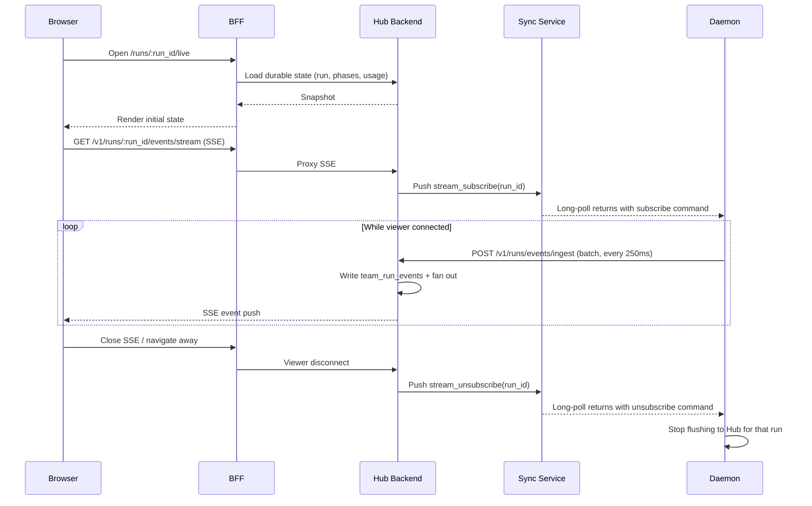

# DESIGN: Run Observability Portal

**Status:** Proposed
**Date:** 2026-09-05
**Repos:** `cliqhub` (backend, BFF, frontend), `cliq` (daemon, SDK, store)

---

## 1. Problem

The current run detail page (`/runs/:run_id`) is a poll-based read of durable state. It shows phase status, log search, an OTEL timeline, and a summary strip — all refreshed every 3–4 seconds. This is adequate for post-mortem inspection but provides no real-time observability into live execution.

**Key gaps:**

1. **Rich agent events never reach Hub.** The daemon captures structured events in memory (LLM output, tool calls, thinking, gate verdicts, progress) and broadcasts them locally via SSE for the CLI. Hub's `team_run_events` table exists with full CRUD but is empty in production — the daemon does not call `events/append`.

2. **No workflow topology visualization.** Teams are DAGs with parallel branches, gate rework loops, and nested sub-teams. The current phase strip is a flat horizontal bar — no edges, no parallelism, no sub-run drill-down.

3. **Cost and token data is shallow.** The `Run_summary_strip` shows run-level totals from the root OTEL span, but per-phase, per-agent, and per-model breakdowns are buried in span attributes. No realm-level aggregation exists.

4. **Streaming infrastructure is broken at the BFF.** Hub exposes `GET /v1/runs/spans/stream` (SSE), but the BFF registers it as a POST passthrough. The frontend uses no `EventSource` connections.

5. **Artifacts are local-only.** Phase outputs stored on daemon are not synced to Hub. No artifact viewer exists.

6. **Run summary depends on viewer.** There is no mechanism for the daemon to push final run statistics (tokens, cost, outcome) to Hub independently of whether anyone watched the run live. If OTEL export fails, the summary strip shows "Waiting for telemetry" indefinitely.

---

## 2. Goals

1. **Real-time observability portal** for live runs: DAG visualization, streaming agent output, structured event rendering — accessible from Hub at `/runs/:run_id/live`.
2. **Durable run summary** on every run, whether viewed or not: total tokens, cost, phase outcomes, duration — populated via the existing outbox.
3. **Viewer-gated streaming** — daemons send granular event data to Hub only when someone is actively watching, using the sync service for subscription control.
4. **Per-phase, per-agent, per-model cost breakdown** in both the live portal and the durable run detail page.

## Non-goals (v1)

- Realm-level billing dashboard or cost aggregation across runs.
- Artifact sync from daemon to Hub or artifact viewer.
- Run comparison / diff view.
- Alerting or anomaly detection on cost/duration.
- Replay with timeline scrubbing for completed runs (data is persisted; UI deferred).
- Sub-run drill-down for nested team phases.

---

## 3. Two Surfaces, Two Data Paths

| Surface | Route | Data source | Always available | Requires viewer |
|---------|-------|------------|-----------------|----------------|
| **Run detail** | `/runs/:run_id` | Durable outbox snapshots | ✓ | No |
| **Observability portal** | `/runs/:run_id/live` | Event stream (best-effort) | Only for completed runs with persisted events | Yes — triggers daemon streaming |

The run detail page is the existing page, enhanced with a richer summary panel using durable usage data. It links to the observability portal: "Watch live" for active runs, "View execution" for completed runs with persisted event data.

---

## 4. Architecture

### 4.1 Two Channels

| Channel | What flows | Delivery | Durability |
|---------|-----------|----------|------------|
| **Outbox** (existing) | Run lifecycle, phase status transitions, **final usage snapshot** | Durable, at-least-once, SQLite-backed | Survives crashes |
| **Event stream** (new) | Agent events, LLM output, tool calls, gate verdicts, progress, incremental usage deltas | Best-effort, low-latency, in-memory buffer | Lossy only on daemon crash (run is also dead) |

### 4.2 Daemon Local Usage Accounting

The daemon maintains **per-run accumulators** updated in real time as agents report usage:

```text
RunUsageAccumulator {
    run_id: string
    total_tokens_in: number
    total_tokens_out: number
    total_cost_usd: number
    total_llm_calls: number
    total_api_calls: number
    total_agent_invocations: number
    by_phase: Map<phase_name, PhaseUsage>
    by_agent: Map<agent_name, AgentUsage>
    by_model: Map<model_key, ModelUsage>    // key = "provider/model"
}
```

**Two delivery modes for usage data:**

| Channel | Content | When | Purpose |
|---------|---------|------|---------|
| **Outbox** | Cumulative usage snapshot (full accumulator state) | Phase complete, run complete | Billing-grade durable totals |
| **Event stream** | Incremental usage delta (e.g., "agent X consumed 1.2K tokens") | While viewer is watching | Live counter animation |

Hub persists outbox snapshots as the authoritative totals. Incremental deltas in the event stream make the live dashboard counters tick up — eye candy, not the source of truth.

When a viewer opens a run mid-execution, Hub serves the last durable snapshot from the outbox, then layers on live deltas from the event stream. Numbers are always correct and never depend on having seen the full stream.

### 4.3 Viewer-Gated Streaming via Sync Service

The sync service (`/v1/sync/poll`) is an existing Hub→daemon command relay. Daemons long-poll; Hub responds instantly when there's a command. This is the subscription control channel.

```text
Browser opens /runs/:run_id/live
    │
    ├─► Hub loads durable state (phases, logs, usage snapshot) ← instant
    ├─► Hub registers viewer for run_id (in-memory viewer set)
    ├─► Hub pushes { type: "stream_subscribe", run_id } via sync
    ├─► Daemon picks up immediately (long-poll returns)
    ├─► Daemon starts flushing event buffer to Hub for that run
    │
Browser closes portal
    │
    ├─► Hub removes viewer from set
    ├─► Hub pushes { type: "stream_unsubscribe", run_id } via sync
    └─► Daemon stops flushing to Hub (buffer continues for local CLI SSE)
```

**Activation latency: near-zero.** The daemon holds an open long-poll. Hub drops the subscribe command, daemon receives it within milliseconds.

The daemon already handles sync commands for `execute`, `install`, `cancel`. Adding `stream_subscribe` / `stream_unsubscribe` is two more command types in the existing handler.

### 4.4 Event Stream Transport (Daemon → Hub)

Batched direct POST — same pattern as the existing `HubSpanExporter`:

- Daemon buffers events in memory per run
- Flushes every **250ms** or when buffer hits **50 events** (whichever first)
- POSTs to `POST /v1/runs/events/ingest` (batch of events for a single run)
- In-memory retry queue on failure, drop after N retries or buffer ceiling (10K events / 5MB)
- On graceful daemon shutdown, flush buffer before exit

Only active for runs in the `streaming_runs` set (populated by sync subscribe commands).

### 4.5 Hub → Browser Push

Hub fans out persisted events to connected browsers via SSE:

- `GET /v1/runs/:run_id/events/stream` — new SSE endpoint on backend
- BFF proxies as GET (fix existing POST-only passthrough pattern)
- Frontend opens `EventSource` on portal mount, closes on unmount
- Backend: on event ingest, write to `team_run_events` + fan out on in-process event bus to SSE connections for that `run_id`

### 4.6 Full Data Flow



---

## 5. Event Schema

Events ingested from the daemon and stored in `team_run_events`:

```text
{
    id: serial                  // Hub-assigned
    run_id: string
    event_type: string          // see table below
    phase: string | null
    agent: string | null
    timestamp: number           // epoch ms, daemon-assigned
    payload: jsonb              // event-type-specific
    created_at: number          // Hub receipt time
}
```

### Event Types

| event_type | phase | agent | payload |
|------------|-------|-------|---------|
| `phase.started` | ✓ | ✓ | `{ attempt }` |
| `phase.completed` | ✓ | ✓ | `{ duration_ms, exit_code }` |
| `phase.failed` | ✓ | ✓ | `{ error, exit_code }` |
| `phase.skipped` | ✓ | — | `{ reason }` |
| `phase.timeout` | ✓ | ✓ | `{ timeout_ms }` |
| `agent.output` | ✓ | ✓ | `{ text, model, provider }` |
| `agent.thinking` | ✓ | ✓ | `{ text }` |
| `agent.tool_call` | ✓ | ✓ | `{ tool, args_summary, result_summary }` |
| `agent.progress` | ✓ | ✓ | `{ message }` |
| `gate.verdict` | ✓ | ✓ | `{ outcome, reasoning, iteration, max_iterations }` |
| `input.requested` | ✓ | — | `{ prompt, schema }` |
| `input.supplied` | ✓ | — | `{ source }` |
| `usage.delta` | ✓ | ✓ | `{ tokens_in, tokens_out, cost_usd, model, provider }` |
| `run.started` | — | — | `{ team, workspace }` |
| `run.completed` | — | — | `{ outcome, duration_ms }` |
| `run.failed` | — | — | `{ error }` |

### Ingest Endpoint

```text
POST /v1/runs/events/ingest
{
    run_id: string,
    daemon_id: string,
    events: [
        { event_type, phase?, agent?, timestamp, payload }
        ...
    ]
}
→ { ok: true, count: number }
```

Bulk insert into `team_run_events`. Fan out each event to SSE connections for `run_id`.

---

## 6. Durable Usage Snapshot (Outbox)

The daemon enqueues a usage snapshot at phase completion and run completion via the existing outbox:

```text
POST /v1/runs/usage/snapshot
{
    run_id: string,
    snapshot_type: "phase" | "run",
    phase?: string,
    usage: {
        total_tokens_in: number,
        total_tokens_out: number,
        total_cost_usd: number,
        total_llm_calls: number,
        total_api_calls: number,
        total_agent_invocations: number,
        by_phase: { [phase]: PhaseUsage },
        by_agent: { [agent]: AgentUsage },
        by_model: { [provider/model]: ModelUsage }
    }
}
```

Hub stores the latest run-level snapshot in a new `run_usage_snapshots` table (or as a JSONB column on `team_runs`). This is the authoritative billing data — always populated, never depends on viewer or event stream.

---

## 7. UX

### 7.1 Layout

Two-panel layout: vertical DAG on the left, tabbed detail panel on the right.

```text
┌─────────────────────────────────────────────────────┐
│  ⏱ 3m42s  🔤 48K/12K  💰 $0.34  🤖 4/7  🔁 1  ⚠ 0  │
├────────────┬────────────────────────────────────────┤
│            │                                        │
│  ◉ plan    │  [All] [planner] [coder] [review] ... │
│  │         ├────────────────────────────────────────┤
│  ▼         │                                        │
│  ◉ code    │  ── coder started ───────────────────  │
│  │         │  🤖 claude-sonnet                      │
│  ▼         │  Implementing auth middleware...        │
│  ◈ review  │  🔧 write_file("src/auth.ts")          │
│  │ ↺       │     › 42 lines                         │
│  ▼         │  🔧 run_command("npm test")             │
│  ○ test    │     › 12 passed                         │
│  │         │  ── coder completed (1m22s) ──────────  │
│  ▼         │                                        │
│  ○ deploy  │                         [▼ Jump to live]│
└────────────┴────────────────────────────────────────┘
```

### 7.2 Metrics Strip (top)

Horizontal bar with live-updating counters:

- Duration (wall clock)
- Tokens in / out
- Cost USD
- Phases completed / total
- Gate reworks
- Errors

Counters are seeded from the durable usage snapshot on load, then tick up from `usage.delta` events in the stream. Click any metric to expand a breakdown by phase, agent, or model.

### 7.3 DAG Panel (left)

Compact vertical flowchart rendered with `@xyflow/react`:

- **Nodes** = phases. Color-coded by status: gray (pending), pulsing blue (running), green (complete), red (failed), amber (gate rework), purple (awaiting input).
- **Edges** = `depends_on` relationships. Animated flow particle on handoff.
- **Gate nodes** show iteration badge: `✓ 2/3`.
- **Sub-team nodes** show a collapsed "team" indicator (drill-down deferred to v2).
- **Parallel branches** rendered as side-by-side nodes — the vertical layout accommodates this naturally.
- **Click a node** → switches the detail panel to that phase's tab.

The DAG is derived from the team manifest topology. Phase status updates (from SSE events or durable state) animate node colors. No content in the DAG — just topology and status.

### 7.4 Detail Panel (right, tabbed)

Tabs along the top, one per executed phase plus an **[All]** tab.

**[All] tab (default):** Unified chronological activity stream across all phases. This is the primary view for watching a live run. Events are rendered as structured cards:

| Event type | Rendering |
|------------|-----------|
| `agent.output` | Streaming text block with model badge and token count tag |
| `agent.tool_call` | Collapsible card: tool name + args summary; expand for full args/result |
| `agent.thinking` | Dimmed/italic block, collapsed by default |
| `gate.verdict` | Pass/fail/rework badge with reasoning and iteration indicator |
| `phase.started` / `phase.completed` | Compact status divider: `── coder completed (1m22s, 18K tokens) ──` |
| `input.requested` | Highlighted prompt block |
| `phase.failed` / `phase.timeout` | Red block with error, collapsible stack trace |
| `usage.delta` | Not rendered as a card — feeds the metrics strip counters |

**Phase tab:** Same card rendering, filtered to events for that phase. Three sub-sections:

- **Output** — the agent's activity stream
- **Gate History** — (gate phases only) iteration timeline showing attempt outcomes and reasoning
- **Metrics** — per-phase usage breakdown (tokens, cost, duration, model)

Auto-scroll follows the live tail. Pauses when user scrolls up. "Jump to live" button appears at the bottom.

### 7.5 Parallel Phase Display

Parallel phases (multiple phases running concurrently) are shown as stacked sections in the **[All]** stream with a visual grouping indicator:

```text
│
┤  ┄┄┄┄┄┄┄┄ parallel ┄┄┄┄┄┄┄┄┄
│
├─ ◉ coder ──────────── ✓ 1m22s
│  │  🤖 Implementing auth...
│  │  🔧 write_file("src/auth.ts")
│
├─ ◉ test-writer ─────── ✓ 48s
│  │  🤖 Writing test suite...
│  │  🔧 write_file("test/auth.test.ts")
│
┤  ┄┄┄┄┄┄┄┄┄┄┄┄┄┄┄┄┄┄┄┄┄┄┄┄┄┄┄
│
```

Events from concurrent phases are interleaved chronologically in the [All] stream. Each event card is tagged with its phase name for disambiguation.

### 7.6 Run Detail Page Enhancement

The existing `/runs/:run_id` page gains a richer summary section using the durable usage snapshot:

- **Usage breakdown table** — per-phase rows with tokens in/out, cost, duration, model
- **"Watch live" button** — links to `/runs/:run_id/live` for active runs
- **"View execution" link** — links to portal for completed runs with persisted events

No other changes to the run detail page. It remains the durable, always-available view.

---

## 8. Implementation Plan

### Phase 1: Daemon Usage Accounting + Durable Snapshot

#### 1a. LLM Agent Usage Instrumentation

**Repo:** `cliq` (agents)

Ensure all six LLM agents call `report_usage()` after each provider API call with accurate fields:

| Agent | Provider API | Fields to report |
|-------|-------------|-----------------|
| `claude-api` | Anthropic Messages API | `provider: "anthropic"`, `model`, `tokens_in` (from `usage.input_tokens`), `tokens_out` (from `usage.output_tokens`) |
| `openai-api` | OpenAI Chat Completions | `provider: "openai"`, `model`, `tokens_in` (from `usage.prompt_tokens`), `tokens_out` (from `usage.completion_tokens`) |
| `gemini-api` | Google Gemini API | `provider: "google"`, `model`, `tokens_in` (from `usageMetadata.promptTokenCount`), `tokens_out` (from `usageMetadata.candidatesTokenCount`) |
| `cursor` | Cursor agent subprocess | `provider: "cursor"`, `model` (if available), `tokens_in`, `tokens_out` (from agent output parsing) |
| `claude-code` | Claude Code subprocess | `provider: "anthropic"`, `model`, `tokens_in`, `tokens_out` (from subprocess output parsing) |
| `codex` | OpenAI Codex subprocess | `provider: "openai"`, `model`, `tokens_in`, `tokens_out` (from subprocess output parsing) |

Agents must **not** report `cost_usd` — Hub calculates cost from tokens.

For subprocess-based agents (`cursor`, `claude-code`, `codex`): parse token counts from the subprocess stdout/stderr if the tool emits usage summaries. If unavailable, report `tokens_in: 0, tokens_out: 0` — the baseline usage (duration, bytes) still populates.

**Files to modify:** `agents/<name>/src/index.ts` (or equivalent entry point) for each of the six agents.

**Tests:**

- `agents/<name>/tests/<name>.spec.ts` — for each LLM agent:
  - Mock the provider API response with known token counts in the response body.
  - Assert `report_usage()` is called with the correct `provider`, `model`, `tokens_in`, `tokens_out`.
  - Assert `cost_usd` is **not** included in the usage report.
  - Test edge case: provider API returns no usage metadata → agent still calls `report_usage()` with zero tokens.

#### 1b. RunUsageAccumulator (Daemon)

**Repo:** `cliq` (daemon)

New file: `daemon/src/core/service/run_usage_accumulator.ts`

- Class `RunUsageAccumulator` — instantiated per run by `RunExecutor`.
- Maintains running tallies: `total_tokens_in`, `total_tokens_out`, `total_llm_calls`, `total_api_calls`, `total_agent_invocations`, plus breakdown maps `by_phase`, `by_agent`, `by_model`.
- Method `record(event: UsageEvent)` — called when an agent's `usage` event arrives on the event bus. Increments all relevant counters.
- Method `snapshot(type: 'phase' | 'run', phase?: string)` — returns the current accumulator state as a serializable object for outbox delivery.
- Method `reset_phase(phase: string)` — clears phase-level accumulators on phase retry (gate rework).

Wire into `RunExecutor`:
- On `usage` event from event bus → `accumulator.record(event)`.
- On phase completion → `hub_run_mirror.enqueue_usage_snapshot(accumulator.snapshot('phase', phase_name))`.
- On run completion → `hub_run_mirror.enqueue_usage_snapshot(accumulator.snapshot('run'))`.

**Files to modify:**
- `daemon/src/core/service/run_executor.ts` — instantiate accumulator, wire event bus listener, call snapshot on phase/run completion.
- `daemon/src/core/service/hub_run_mirror.ts` — new method `enqueue_usage_snapshot(snapshot)` targeting `POST /v1/runs/usage/snapshot`.

**Tests:**

Unit — `daemon/tests/spec/service/run_usage_accumulator.spec.ts`:
- `record()` increments total counters correctly for a single usage event.
- `record()` accumulates across multiple events (different agents, different models).
- `by_phase` map is keyed correctly — events for different phases land in separate buckets.
- `by_agent` and `by_model` maps aggregate across phases.
- `snapshot('phase', 'coder')` returns only the phase-level breakdown for that phase plus a phase total.
- `snapshot('run')` returns the full accumulator state with all breakdowns.
- `reset_phase()` clears phase counters without affecting run-level or other-phase tallies.
- Edge case: `record()` with zero tokens — counters unchanged but `total_llm_calls` still increments.
- Edge case: unknown model key — accumulator creates a new `by_model` entry dynamically.

Integration — `daemon/tests/spec/service/run_executor_usage.spec.ts`:
- Execute a two-phase run with mocked agents that emit `usage` events.
- Assert `hub_run_mirror.enqueue_usage_snapshot` called once per phase completion with phase-level snapshot.
- Assert `hub_run_mirror.enqueue_usage_snapshot` called once on run completion with run-level snapshot.
- Assert snapshot payload structure matches expected schema (all fields present, correct types).
- Gate rework scenario: agent emits usage on attempt 1, gate reworks, agent emits again on attempt 2. Assert phase snapshot reflects cumulative usage across attempts (or reset per attempt — decide based on desired semantics).

#### 1c. Daemon Local Event Persistence

**Repo:** `cliq` (store, daemon)

New store model: `RunEvent` in `store/src/models/run_event.ts`.

The `RunEvent` model already exists in the store but is unused at runtime. Activate it:

- Schema: `id` (auto), `run_id`, `event_type`, `phase`, `agent`, `timestamp` (daemon epoch ms), `payload` (JSON text), `created_at`.
- Index on `(run_id, id)` for ordered retrieval and replay.

New method on `RunEventRepository`: `append_batch(run_id, events[])` — bulk insert.

Wire into `RunExecutor` event bus: all events (not just usage) are written to SQLite as they occur. This is the daemon's local archive for replay.

Add retention purge: `RunEventRepository.purge_before(cutoff_date)` — called on daemon startup and periodically (e.g. hourly). Cutoff derived from org-level retention setting pulled via settings sync.

**Files to modify:**
- `store/src/models/run_event.ts` — activate / update model definition.
- `store/src/repositories/run_event.repository.ts` — `append_batch`, `get_by_run_id(run_id, after_id?)`, `purge_before(date)`.
- `daemon/src/core/service/run_executor.ts` — write events to SQLite via repository.
- `daemon/src/core/service/settings.service.ts` (or equivalent) — pull org retention setting.

**Tests:**

Unit — `store/tests/run_event.repository.test.ts`:
- `append_batch` inserts multiple events; `get_by_run_id` returns them in order.
- `get_by_run_id` with `after_id` cursor returns only events after that id (for replay resume).
- `purge_before` deletes events older than cutoff; events after cutoff remain.
- Empty batch insert is a no-op.

Integration — `daemon/tests/spec/service/run_executor_events.spec.ts`:
- Execute a simple run with a mocked agent that emits several event types.
- Assert events are persisted to SQLite with correct `run_id`, `event_type`, `phase`, `agent`, `payload`.
- Assert event ordering matches emission order.

#### 1d. Model Pricing Table + Cost Resolution (Hub)

**Repo:** `cliqhub` (backend)

**Schema migration** — new table in the `cliq` schema:

```sql
CREATE TABLE IF NOT EXISTS cliq.model_pricing (
    id              SERIAL PRIMARY KEY,
    provider        TEXT NOT NULL,
    model           TEXT NOT NULL,
    input_per_1m    NUMERIC(12, 6) NOT NULL,
    output_per_1m   NUMERIC(12, 6) NOT NULL,
    effective_from  DATE NOT NULL DEFAULT CURRENT_DATE,
    created_at      TIMESTAMPTZ NOT NULL DEFAULT NOW(),
    UNIQUE (provider, model, effective_from)
);
CREATE INDEX idx_model_pricing_lookup
    ON cliq.model_pricing (provider, model, effective_from DESC);
```

Add migration to `services/backend/src/core_api/db/schema_migrations.ts`.

**Seed file** — `seed/model_pricing.json`:

```json
[
    { "provider": "anthropic", "model": "claude-sonnet-4-20250514", ... },
    { "provider": "anthropic", "model": "claude-opus-4-20250514", ... },
    { "provider": "openai", "model": "gpt-4o", ... },
    { "provider": "openai", "model": "gpt-4o-mini", ... },
    { "provider": "openai", "model": "o3", ... },
    { "provider": "google", "model": "gemini-2.5-pro", ... },
    { "provider": "google", "model": "gemini-2.5-flash", ... },
    ...
]
```

Populate at current rates for all models the six LLM agents use. Add to the `npm run db:setup` pipeline via a seed script (`seed/model_pricing.ts`).

**Pricing service** — `services/backend/src/core_api/services/model_pricing.service.ts`:

- `resolve_cost(provider, model, tokens_in, tokens_out, run_started_at)` — looks up the latest `model_pricing` row where `provider` and `model` match and `effective_from <= run_started_at`. Returns `cost_usd`. Returns `null` if no matching rate found (unknown model — cost stored as null, not zero).
- Caches pricing rows in memory (small table, refreshed on a timer or at startup).

**Usage snapshot endpoint** — `POST /v1/runs/usage/snapshot`:

- Receives daemon usage snapshot (tokens only, no cost).
- For each entry in `by_model`, calls `resolve_cost()` to calculate `cost_usd`.
- Writes enriched snapshot (with cost) to JSONB `usage_snapshot` column on `team_runs` (for `snapshot_type: 'run'`) or `team_run_phases` (for `snapshot_type: 'phase'`).
- Schema migration: add `usage_snapshot JSONB` column to `team_runs` and `team_run_phases`.

**Retrieval endpoint** — `POST /v1/runs/usage/get`:

- Input: `{ run_id }`.
- Returns the run-level `usage_snapshot` plus all phase-level snapshots for that run.

**BFF passthrough** — add both endpoints to `CONTROL_PLANE_PASSTHROUGH_PATHS`.

**Files to create:**
- `services/backend/src/core_api/services/model_pricing.service.ts`
- `seed/model_pricing.json`
- `seed/model_pricing.ts`

**Files to modify:**
- `services/backend/src/core_api/db/schema_migrations.ts` — `model_pricing` table + `usage_snapshot` columns.
- `services/backend/src/core_api/routes.ts` — register `usage/snapshot` and `usage/get`.
- `services/backend/src/core_api/services/run.service.ts` — `ingest_usage_snapshot` method.
- `services/backend/src/container.ts` — wire `ModelPricingService`.
- `services/bff/src/lib/control_plane_routes.ts` — add passthrough paths.

**Tests:**

Unit — `services/backend/tests/unit/core_api/model_pricing.service.test.ts`:
- `resolve_cost` returns correct cost for known provider/model with one rate row.
- `resolve_cost` picks the correct rate when multiple `effective_from` dates exist (most recent before `run_started_at`).
- `resolve_cost` returns `null` for unknown provider/model.
- `resolve_cost` handles edge case: `run_started_at` is before any `effective_from` → returns `null`.
- Cache refresh: after inserting a new rate, service picks it up after cache refresh.

Integration — `services/backend/tests/migrated_platform/usage_snapshot.test.ts` (Postgres, `describe.skipIf(!has_postgres)`):
- Seed `model_pricing` with test rates. Create a run. POST to `/v1/runs/usage/snapshot` with token counts.
- Assert snapshot is stored on `team_runs.usage_snapshot` with cost resolved.
- Assert per-phase snapshot stored on `team_run_phases.usage_snapshot`.
- POST to `/v1/runs/usage/get` — returns run + phase snapshots with correct cost values.
- Unknown model in snapshot — cost for that model entry is `null`, rest are resolved.
- Multiple snapshots for same run (phase 1 complete, phase 2 complete, run complete) — each overwrites the previous at the appropriate level.

BFF — `services/bff/tests/unit/route_surface_audit.test.ts`:
- Add assertions that `/v1/runs/usage/snapshot` and `/v1/runs/usage/get` are present in passthrough paths.

**Outcome:** Every completed run has durable per-phase, per-agent, per-model usage data on Hub with Hub-calculated cost. Pricing is version-controlled and historically accurate.

---

### Phase 2: Event Stream Pipeline (Daemon → Hub)

#### 2a. HubEventStreamer (Daemon)

**Repo:** `cliq` (daemon)

New file: `daemon/src/core/service/hub_event_streamer.ts`

Modeled on the refactored `HubSpanExporter` (`hub_span_exporter.ts`):

- **Dedicated HTTP transport** via `make_agents()` + `post_json()` from `core/lib/hub_http.ts`. Must NOT use global `fetch` — the sync poller's long-poll connections saturate undici's dispatcher and cause timeouts (same issue that prompted the span exporter refactor in `71d46df`). The event streamer gets its own `https.Agent` pool (e.g. `make_agents(4)`).
- **Test injection seams** following the span exporter pattern: `_test_set_event_transport(fn)` / `_test_reset_event_transport()` so tests can substitute a mock without touching the network.
- Maintains a per-run in-memory ring buffer (max 10K events or 5MB, whichever first; oldest dropped on overflow).
- Flush timer: **250ms** interval. On tick, for each run in `streaming_runs`, batch-POST buffered events to Hub `POST /v1/runs/events/ingest`.
- **Standalone retry timer** with linear backoff (2s base, 60s cap), matching the span exporter's `_schedule_retry` pattern. Retries are not gated on the next flush cycle — a standalone timer drains the retry queue independently. This prevents lost events when a run's last batch fails and no further events trigger a flush.
- Retry queue capped at 512 payloads (matching span exporter's `MAX_RETRY_QUEUE`). Oldest dropped on overflow.
- Timer `unref()` to avoid blocking clean shutdown in tests/CLI.
- `streaming_runs: Set<string>` — populated by sync command handler.
- Method `subscribe(run_id)` — adds to set; if the run has a local event archive in SQLite, marks it for replay (see 2d).
- Method `unsubscribe(run_id)` — removes from set; buffer for that run is cleared.
- Method `buffer(run_id, event)` — called from event bus; appends to the run's ring buffer. No-op if run not in `streaming_runs` (events still go to local SQLite per Phase 1c).
- On daemon graceful shutdown: flush all pending buffers before exit (same `shutdown()` pattern as span exporter — clear timer, drain queue).
- On run completion: flush remaining buffer, then auto-unsubscribe.

**Files to create:**
- `daemon/src/core/service/hub_event_streamer.ts`

**Files to modify:**
- `daemon/src/core/service/run_executor.ts` — wire event bus to `hub_event_streamer.buffer()` alongside existing local SSE broadcast and SQLite persistence.
- `daemon/src/app.ts` or DI container — instantiate and register `HubEventStreamer`.

**Tests:**

Unit — `daemon/tests/spec/service/hub_event_streamer.spec.ts`:

Use `_test_set_event_transport(mock_fn)` in `beforeEach`, `_test_reset_event_transport()` in `afterEach` — same seam pattern as `hub_span_exporter.spec.ts`.

- `buffer()` with run **not** in `streaming_runs` — no events accumulate (no-op).
- `buffer()` with run in `streaming_runs` — events accumulate in ring buffer.
- `subscribe(run_id)` adds to set; subsequent `buffer()` calls accumulate.
- `unsubscribe(run_id)` removes from set and clears that run's buffer.
- Flush cycle: mock transport returns `{ status: 200 }`. After 250ms, assert transport called with correct URL, auth headers, and batch payload.
- Flush cycle with no buffered events — no transport call made.
- Buffer overflow: insert > 10K events, assert oldest are dropped, newest retained.
- Retry on failure: mock transport returns `{ status: 500 }`. Assert events enter retry queue. Assert standalone retry timer fires (advance timers with `vi.advanceTimersByTime`). Assert retry drains queue on next tick.
- Retry backoff: assert delay increases linearly (2s, 4s, 6s…) up to 60s cap.
- Retry queue overflow: fill > 512 payloads, assert oldest dropped.
- Retry success resets backoff: after successful drain, next failure starts at 2s again.
- Last-batch problem: run completes, last flush fails, assert standalone retry timer fires and delivers the batch (not gated on next `buffer()` call).
- Auto-unsubscribe on run completion: after run terminal event, assert next flush sends remaining events then removes run from set.
- Graceful shutdown: call `shutdown()`, assert timer cleared, retry queue drained, all pending buffers flushed via transport before promise resolves.
- Multiple concurrent runs: events for run A and run B are batched and POSTed separately.
- Transport uses dedicated agents (not global fetch): assert `post_json` called with agent args (or verify via transport seam that the right function shape is used).

#### 2b. Sync Subscribe/Unsubscribe Commands

**Repo:** `cliqhub` (sync)

Add two command types to the sync command queue:

- `stream_subscribe` — payload: `{ run_id, viewer_id }`
- `stream_unsubscribe` — payload: `{ run_id, viewer_id }`

These are FoF (fire-and-forget) — no `tx_id`, no ack, no dedup.

**Repo:** `cliqhub` (backend)

New file: `services/backend/src/core_api/services/run_viewer.service.ts`

- In-memory `Map<run_id, Set<viewer_id>>` tracking active viewers per run.
- Method `add_viewer(run_id, daemon_id, viewer_id)` — adds to set. If this is the first viewer for this run, enqueue `stream_subscribe` command to the sync service for the run's daemon.
- Method `remove_viewer(run_id, viewer_id)` — removes from set. If set is now empty, enqueue `stream_unsubscribe`.
- Method `has_viewers(run_id)` — boolean check.
- Viewer IDs are Hub-assigned UUIDs, created per SSE connection.

**Repo:** `cliq` (daemon)

Modify the sync command handler (the module that processes commands received via `/v1/sync/poll`):

- On `stream_subscribe`: call `hub_event_streamer.subscribe(run_id)`.
- On `stream_unsubscribe`: call `hub_event_streamer.unsubscribe(run_id)`.

**Files to modify:**
- `services/sync/src/` — add command types to schema/relay.
- `services/backend/src/core_api/routes.ts` — internal endpoint for viewer registration (called by SSE lifecycle, not exposed externally).
- `daemon/src/core/sync/connect.ts` (or equivalent command handler) — handle new command types.

**Tests:**

Unit — `services/backend/tests/unit/core_api/run_viewer.service.test.ts`:
- `add_viewer` for first viewer on a run → enqueues `stream_subscribe` to sync.
- `add_viewer` for second viewer on same run → no additional subscribe command.
- `remove_viewer` with remaining viewers → no unsubscribe.
- `remove_viewer` for last viewer → enqueues `stream_unsubscribe`.
- `remove_viewer` for unknown viewer_id → no-op, no error.
- `has_viewers` returns correct boolean.

Unit — `daemon/tests/spec/sync/stream_commands.spec.ts`:
- Receiving `stream_subscribe` command → calls `hub_event_streamer.subscribe(run_id)`.
- Receiving `stream_unsubscribe` command → calls `hub_event_streamer.unsubscribe(run_id)`.
- Receiving subscribe for already-subscribed run → idempotent, no error.
- Receiving unsubscribe for non-subscribed run → no-op, no error.

#### 2c. Event Ingest + SSE Endpoint (Hub)

**Repo:** `cliqhub` (backend)

**Ingest endpoint** — `POST /v1/runs/events/ingest`:

- Input: `{ run_id, daemon_id, events: [{ event_type, phase?, agent?, timestamp, payload }] }`.
- Validate `run_id` belongs to the authenticated realm.
- Bulk insert into `team_run_events`.
- Fan out each event to an in-process `RUN_EVENT_BUS` (same pattern as existing `RUN_SPAN_BUS` for span SSE).
- Response: `{ ok: true, count: <inserted> }`.

**SSE endpoint** — `GET /v1/runs/:run_id/events/stream`:

- Authenticate via Bearer or session (BFF proxy).
- Validate access to the run's realm.
- On connection open: register viewer via `RunViewerService.add_viewer(run_id, daemon_id, viewer_id)`.
- Optionally replay: query `team_run_events` for existing events for this run (supports `?after_id=` cursor for reconnect).
- Subscribe to `RUN_EVENT_BUS` for `run_id` — push new events as `data:` SSE lines.
- On connection close: `RunViewerService.remove_viewer(run_id, viewer_id)`.
- Heartbeat: send SSE comment (`: keepalive`) every 30s to prevent proxy/LB timeout.

**BFF GET proxy:**

The BFF currently only registers POST routes for passthrough. Add a GET passthrough handler:

- `GET /v1/runs/:run_id/events/stream` → proxy to backend as GET, stream response body through to the browser (chunked transfer, no buffering).
- Ensure BFF does not buffer the SSE response (set appropriate headers: `Cache-Control: no-cache`, `X-Accel-Buffering: no` for nginx).

**Files to create:**
- `services/backend/src/core_api/controllers/run_event_stream.controller.ts` — SSE endpoint handler.
- `services/backend/src/core_api/services/run_event_bus.ts` — in-process pub/sub for run events (or extend existing span bus pattern).

**Files to modify:**
- `services/backend/src/core_api/routes.ts` — register `events/ingest` (POST) and `events/stream` (GET).
- `services/backend/src/core_api/services/run.service.ts` — `ingest_events` method.
- `services/backend/src/container.ts` — wire new services.
- `services/bff/src/app.ts` — add GET route for SSE proxy.
- `services/bff/src/lib/control_plane_routes.ts` — add ingest to passthrough paths.

**Tests:**

Unit — `services/backend/tests/unit/core_api/run_event_bus.test.ts`:
- Subscribe to a run_id, publish an event → subscriber receives it.
- Two subscribers on same run_id → both receive.
- Publish to run_id with no subscribers → no error.
- Unsubscribe → no longer receives.

Integration — `services/backend/tests/migrated_platform/run_events_ingest.test.ts` (Postgres):
- POST batch of 5 events to `/v1/runs/events/ingest` → all 5 stored in `team_run_events`.
- Assert stored events have correct `run_id`, `event_type`, `phase`, `agent`, `payload`, `timestamp`.
- Assert events have sequential auto-increment `id` values.
- Ingest for non-existent run_id → 404 or validation error.
- Ingest with empty events array → 200, count: 0.
- Query `events/get` (existing endpoint) after ingest → returns the ingested events.

Integration — `services/backend/tests/migrated_platform/run_event_stream.test.ts` (Postgres):
- Open SSE connection to `/v1/runs/:run_id/events/stream`.
- POST events to ingest endpoint.
- Assert SSE client receives the events in order.
- Reconnect with `?after_id=` → only new events received (no replay of already-seen).
- Connection close → `RunViewerService.remove_viewer` called.

BFF — `services/bff/tests/unit/route_surface_audit.test.ts`:
- Assert `/v1/runs/events/ingest` is in passthrough paths.

BFF — `services/bff/tests/integration/run_event_stream.test.ts`:
- GET `/v1/runs/:run_id/events/stream` through BFF → verify response headers (`text/event-stream`, `no-cache`, `no-transform`).
- Verify BFF does not buffer the response (chunked passthrough).

#### 2d. Replay from Daemon (Completed Runs)

**Repo:** `cliq` (daemon)

When `hub_event_streamer.subscribe(run_id)` is called for a **completed** run:

- Check if the run is in terminal state locally.
- If terminal: read events from local SQLite via `RunEventRepository.get_by_run_id(run_id)`.
- Stream them through the same `HubEventStreamer` flush pipeline (batched POST) as if they were live, with a `replay: true` flag in the ingest payload so Hub can distinguish.
- After replay completes, auto-unsubscribe.

If terminal and no local events found (purged or run was on a different daemon): respond to subscribe with an empty replay; Hub shows whatever durable state it has.

**Files to modify:**
- `daemon/src/core/service/hub_event_streamer.ts` — replay logic in `subscribe()`.

**Tests:**

Unit — `daemon/tests/spec/service/hub_event_streamer_replay.spec.ts`:
- Subscribe to a completed run with 100 local SQLite events → all 100 POSTed to Hub in batches.
- Replay preserves original event ordering and timestamps.
- After replay finishes, run is auto-unsubscribed.
- Subscribe to a completed run with no local events → single empty flush, then unsubscribe.
- Subscribe to a still-running run → no replay, normal live streaming behavior.

**Outcome:** Full event stream pipeline operational. Daemons stream when viewers are present, replay completed runs on demand from local archive.

---

### Phase 3: Observability Portal Frontend

#### 3a. Route + Page Shell

**Repo:** `cliqhub` (frontend)

New route in `src/router.tsx`: `/runs/:run_id/live` → lazy-loaded `RunObservabilityPage`.

Page shell (`src/pages/runs/run_observability_page.tsx`):
- Layout: metrics strip (top), two-panel body (DAG left, detail right) using CSS grid or flexbox.
- On mount: fetch run metadata (`/v1/runs/get_by_id`), team manifest (for DAG topology), durable usage snapshot (`/v1/runs/usage/get`), and phase status (`/v1/runs/phases/get`).
- On mount: open `EventSource` to `/v1/runs/:run_id/events/stream`. This triggers the viewer registration → sync subscribe → daemon streaming pipeline.
- On unmount: close `EventSource`. Hub detects disconnect → sync unsubscribe → daemon stops streaming.
- Manage SSE reconnect: `EventSource` auto-reconnects natively. Pass `?after_id=<last_seen_id>` on reconnect to avoid duplicate events.

**Files to create:**
- `src/pages/runs/run_observability_page.tsx`
- `src/hooks/use_run_event_stream.ts` — `EventSource` hook with reconnect, cursor tracking, event dispatch to local state.

**Files to modify:**
- `src/router.tsx` — add route.

**Tests:**

- `src/__tests__/run_observability_page.test.tsx`:
  - Renders metrics strip, DAG panel, and detail panel on initial load.
  - Mock fetch: returns run metadata, phases, usage snapshot. Assert all three sections populated.
  - Assert `EventSource` opened with correct URL on mount.
  - Assert `EventSource` closed on unmount.

- `src/__tests__/use_run_event_stream.test.ts`:
  - Opens `EventSource` to correct URL.
  - On SSE `message` event → dispatches parsed event to callback.
  - On SSE `error` → reconnects with `after_id` cursor.
  - Cleanup on unmount closes connection.

#### 3b. Metrics Strip Component

**Repo:** `cliqhub` (frontend)

New component: `src/components/observability/metrics_strip.tsx`

- Props: `usage_snapshot` (durable, for initial seed), `events` (live stream for incremental updates).
- Displays: duration (live timer for active runs), tokens in/out, cost USD, phases completed/total, gate reworks, errors.
- On `usage.delta` events from stream: increment local counters on top of snapshot baseline.
- Click a metric → expand a popover/drawer with breakdown by phase, agent, or model.

**Files to create:**
- `src/components/observability/metrics_strip.tsx`
- `src/components/observability/usage_breakdown_popover.tsx` — breakdown table shown on metric click.

**Tests:**

- `src/__tests__/metrics_strip.test.tsx`:
  - Renders all metric values from initial usage snapshot.
  - After receiving `usage.delta` events, counters increment correctly.
  - Duration timer ticks for active runs (mock `setInterval`).
  - Duration is static for completed runs.
  - Click tokens metric → breakdown popover appears with per-model rows.
  - Zero-cost run → displays `$0.00`, not blank.

#### 3c. DAG Panel Component

**Repo:** `cliqhub` (frontend)

New component: `src/components/observability/dag_panel.tsx`

- Props: `phases` (from team manifest — names, types, `depends_on`, `max_iterations`), `phase_statuses` (live, from SSE + initial fetch).
- Renders a vertical `@xyflow/react` graph:
  - Nodes: one per phase. Styled by status (gray/pending, pulsing blue/running, green/complete, red/failed, amber/gate rework, purple/awaiting input).
  - Edges: derived from `depends_on`. Animated flow particle on active edge.
  - Gate nodes: iteration badge showing current/max (`✓ 2/3`).
  - Sub-team nodes: collapsed "team" indicator (non-interactive in v1).
- Layout: automatic top-to-bottom DAG layout using `@xyflow/react` `dagre` or `elk` layout algorithm.
- Interaction: click a node → callback to parent to switch detail tab.
- Updates: on `phase.started`, `phase.completed`, `phase.failed`, `gate.verdict` events → update node status + animate edges.

**Files to create:**
- `src/components/observability/dag_panel.tsx`
- `src/components/observability/dag_phase_node.tsx` — custom node component with status styling + badges.

**Tests:**

- `src/__tests__/dag_panel.test.tsx`:
  - Renders correct number of nodes for a 5-phase manifest.
  - Nodes have correct initial status colors from phase_statuses prop.
  - On phase status update (simulated event), node color changes.
  - Click a node → `on_phase_select` callback fired with phase name.
  - Gate node shows iteration badge.
  - Linear DAG (no parallelism) renders as a straight vertical chain.
  - Parallel branches (two phases with same dependency) render as side-by-side nodes.

#### 3d. Detail Panel + Event Card Renderer

**Repo:** `cliqhub` (frontend)

New components:
- `src/components/observability/detail_panel.tsx` — tabbed container.
- `src/components/observability/activity_stream.tsx` — scrollable event list with auto-follow.
- `src/components/observability/event_cards/` — directory of card components per event type:
  - `agent_output_card.tsx` — streaming text block with model badge.
  - `agent_tool_call_card.tsx` — collapsible: tool name + summary, expand for full args/result.
  - `agent_thinking_card.tsx` — dimmed/italic, collapsed by default.
  - `gate_verdict_card.tsx` — pass/fail/rework badge with reasoning.
  - `phase_transition_card.tsx` — compact divider with status + metrics.
  - `input_requested_card.tsx` — highlighted prompt block.
  - `error_card.tsx` — red block with collapsible stack trace.

Detail panel behavior:
- **[All] tab:** renders `activity_stream` with all events chronologically. Each card tagged with phase name for disambiguation.
- **[phase] tabs:** same `activity_stream`, filtered to that phase. Sub-tabs for Output, Gate History (gate phases only), Metrics (per-phase usage from snapshot).
- Auto-scroll: follows tail while user is at bottom. Pauses when user scrolls up. "Jump to live" button appears at bottom edge.
- Parallel phase grouping: when events from concurrent phases interleave in [All], insert visual `── parallel ──` markers when the active phase set changes.

**Files to create:**
- `src/components/observability/detail_panel.tsx`
- `src/components/observability/activity_stream.tsx`
- `src/components/observability/event_cards/*.tsx` (7 card components)

**Tests:**

- `src/__tests__/detail_panel.test.tsx`:
  - Renders [All] tab by default.
  - Renders one tab per phase from manifest.
  - Clicking a phase tab filters events to that phase.
  - `on_phase_select` prop (from DAG click) switches to correct tab.

- `src/__tests__/activity_stream.test.tsx`:
  - Renders event cards in chronological order.
  - New event appended → scrolls to bottom (when already at bottom).
  - User scrolls up → auto-scroll pauses, "Jump to live" button appears.
  - Click "Jump to live" → scrolls to bottom, auto-scroll resumes.

- `src/__tests__/event_cards/agent_output_card.test.tsx`:
  - Renders text content and model badge.
  - Long output is scrollable within the card.

- `src/__tests__/event_cards/agent_tool_call_card.test.tsx`:
  - Renders collapsed: shows tool name and args summary.
  - Click expand → shows full args and result.

- `src/__tests__/event_cards/gate_verdict_card.test.tsx`:
  - Renders pass badge with green styling.
  - Renders rework badge with amber styling + iteration count.
  - Renders fail badge with red styling + reasoning text.

- `src/__tests__/event_cards/phase_transition_card.test.tsx`:
  - Renders phase name, status, duration, and token count.

- `src/__tests__/event_cards/error_card.test.tsx`:
  - Renders error message prominently.
  - Stack trace is collapsed by default; click to expand.

#### 3e. Viewer Lifecycle

**Repo:** `cliqhub` (backend, frontend)

**Backend:** The SSE endpoint (Phase 2c) already handles viewer registration on connect and deregistration on disconnect. No additional backend work in Phase 3.

**Frontend:** The `use_run_event_stream` hook (Phase 3a) manages the `EventSource` lifecycle. On mount it opens the connection (which triggers Hub-side viewer registration → sync subscribe). On unmount it closes (which triggers deregistration → sync unsubscribe).

Add periodic health check: if no SSE events or keepalive received for 60s, assume connection is stale — close and reopen `EventSource` with `?after_id=` cursor.

**Tests:**

- Covered by `use_run_event_stream.test.ts` (Phase 3a) and SSE endpoint tests (Phase 2c).
- Additional: `src/__tests__/run_observability_page.test.tsx` — navigate away from page → assert `EventSource` closed (cleanup).

#### 3f. Link from Run Detail Page

**Repo:** `cliqhub` (frontend)

Modify `src/pages/runs/run_detail_page.tsx`:

- For runs in `running` or `awaiting_input` state: add "Watch live" button linking to `/runs/:run_id/live`.
- For completed runs: add "View execution" link to `/runs/:run_id/live` (triggers replay).
- For runs in `pending` or `queued` state: no link (nothing to observe yet).

**Tests:**

- `src/__tests__/run_detail_page_observability_link.test.tsx`:
  - Running run → "Watch live" button visible, links to `/runs/:run_id/live`.
  - Completed run → "View execution" link visible.
  - Pending run → neither button nor link shown.

**Outcome:** Full observability portal accessible, with live streaming for active runs and on-demand replay for completed runs.

---

### Phase 4: Run Detail Page Enhancement

#### 4a. Usage Snapshot Data Source

**Repo:** `cliqhub` (frontend)

Replace the data source for `Run_summary_strip`:

- Currently reads from OTEL root span attributes (`run.usage.*`) via `/v1/runs/spans/get`.
- Change to read from durable usage snapshot via `/v1/runs/usage/get`.
- Remove the "Waiting for telemetry" state — usage snapshot is always available for completed runs (delivered via outbox, not OTEL export).
- For active runs: show snapshot from last completed phase + note "in progress."

**Files to modify:**
- `src/components/runs/run_summary_strip.tsx` — change data fetch from spans to usage endpoint.
- `src/pages/runs/run_detail_page.tsx` — update data fetching logic.

**Tests:**

- `src/__tests__/run_summary_strip.test.tsx`:
  - Mock `/v1/runs/usage/get` → renders token counts, cost, duration from snapshot.
  - No usage snapshot (very old run, pre-feature) → shows "No usage data" instead of "Waiting for telemetry."
  - Active run with partial snapshot → shows cumulative totals with "in progress" indicator.

#### 4b. Usage Breakdown Table

**Repo:** `cliqhub` (frontend)

New component: `src/components/runs/usage_breakdown_table.tsx`

- Renders a table from the usage snapshot: one row per phase, columns for tokens in, tokens out, cost, duration, model.
- Expandable rows: click a phase row → shows per-agent breakdown within that phase.
- Summary row at bottom with run totals.
- Sorted by phase execution order (sequence field).

**Files to create:**
- `src/components/runs/usage_breakdown_table.tsx`

**Files to modify:**
- `src/pages/runs/run_detail_page.tsx` — add the breakdown table below the summary strip.

**Tests:**

- `src/__tests__/usage_breakdown_table.test.tsx`:
  - Renders one row per phase from snapshot.
  - Summary row shows correct totals.
  - Click phase row → expands to show per-agent sub-rows.
  - Empty snapshot → shows "No usage data" message.
  - Phase with null cost (unknown model) → displays "—" in cost column.

**Outcome:** Run detail page shows rich, durable cost/usage data for every run. No dependency on OTEL export or viewer presence.

---

## 9. Sync Command Schema

New command types for the existing sync relay:

```text
stream_subscribe
{
    type: "stream_subscribe",
    run_id: string,
    viewer_id: string       // Hub-assigned, for dedup
}

stream_unsubscribe
{
    type: "stream_unsubscribe",
    run_id: string,
    viewer_id: string
}
```

These are **FoF (fire-and-forget)** per the control message reliability design — no `tx_id`, no ack required. If a subscribe is lost, the viewer sees durable state via polling and re-subscribes on reconnect. If an unsubscribe is lost, the daemon streams for at most one flush cycle beyond what's needed — negligible waste.

---

## 10. Failure Modes

| Failure | Impact | Mitigation |
|---------|--------|------------|
| Daemon crashes mid-run | Event buffer lost. Run is also dead. | Outbox delivers terminal state (run_crashed). Durable usage snapshot from last phase completion is intact. |
| Hub temporarily unreachable | Events buffer in daemon memory, retry on next flush. | Buffer ceiling (10K events / 5MB) prevents OOM. Oldest events dropped first. Outbox handles lifecycle durably. |
| Subscribe command lost via sync | Daemon doesn't start streaming. | Viewer sees durable state via polling. Frontend re-subscribes periodically or on reconnect. |
| Unsubscribe command lost | Daemon streams slightly longer than needed. | Daemon auto-unsubscribes when run completes. Negligible overhead for one extra flush cycle. |
| Browser SSE disconnects | Hub detects closed connection, decrements viewer count. | If last viewer gone, unsubscribe sent. Browser reconnects `EventSource` automatically (built-in SSE behavior). |
| Multiple viewers on same run | Hub tracks viewer count, not viewer identity. | Subscribe sent once on first viewer. Unsubscribe sent when count reaches zero. |

---

## 11. Decisions

1. **Event retention policy.** Hub-side `team_run_events` rows are retained per a configurable org-level setting. Default: **30 days**. Purged on a scheduled basis. This governs the lightweight Hub copy used for live viewing and short-term access — not the long-term archive.

2. **Completed run replay.** Supported, on-demand, from the **daemon's local store**. The daemon persists structured events to SQLite during execution (always, regardless of viewer). When a user requests replay of a completed run, Hub sends `stream_subscribe` for that run via sync. The daemon replays from local SQLite through the same event stream pipeline. The portal UI is identical for live and replay — same DAG, same activity stream, same event cards. This avoids inflating Hub storage for historical data and keeps the daemon as the long-term event archive. Replay UI enhancements (timeline scrubbing, playback speed) are deferred to a future iteration.

---

## 12. Decisions (continued)

3. **Agent usage instrumentation.** All LLM agents (`claude-api`, `openai-api`, `gemini-api`, `cursor`, `claude-code`, `codex`) must call `report_usage()` with accurate `tokens_in`, `tokens_out`, `provider`, and `model`. Agents do **not** report `cost_usd`. Non-LLM agents rely on baseline usage. Detailed in Phase 1a.

4. **Cost calculation.** Hub-side only. `model_pricing` table with `effective_from` for historical accuracy. Pricing sourced from version-controlled `seed/model_pricing.json`, seeded at deploy. Detailed in Phase 1d.

5. **Daemon storage retention.** Follows org-level setting (default 30 days). Daemon pulls retention policy from Hub via settings sync and purges local SQLite events accordingly.

