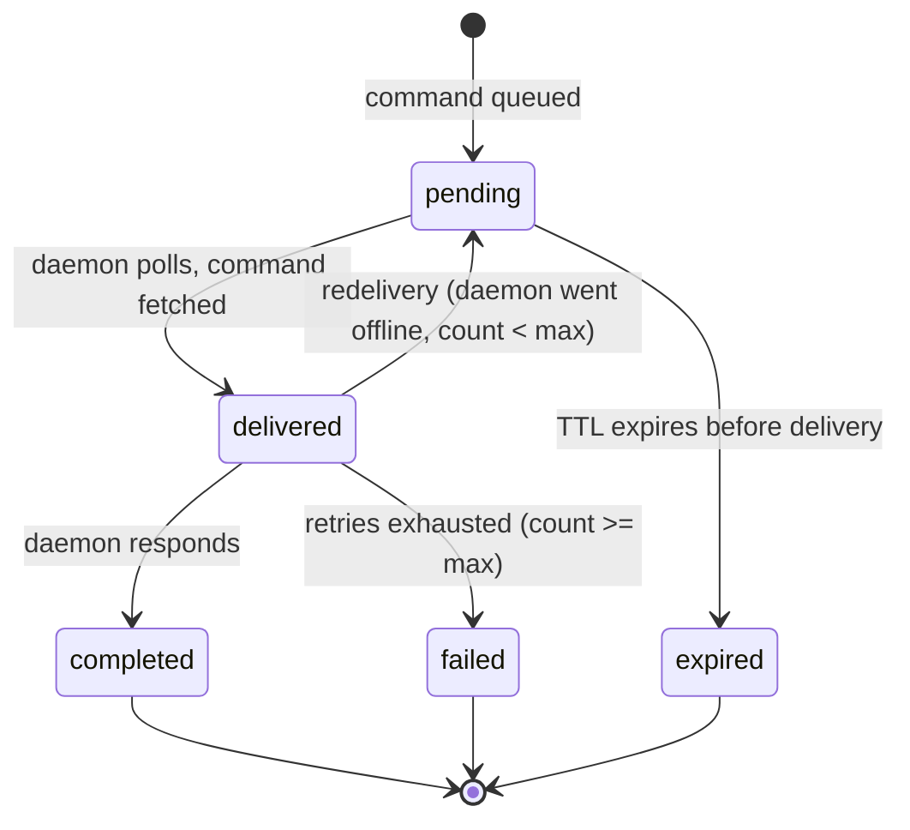
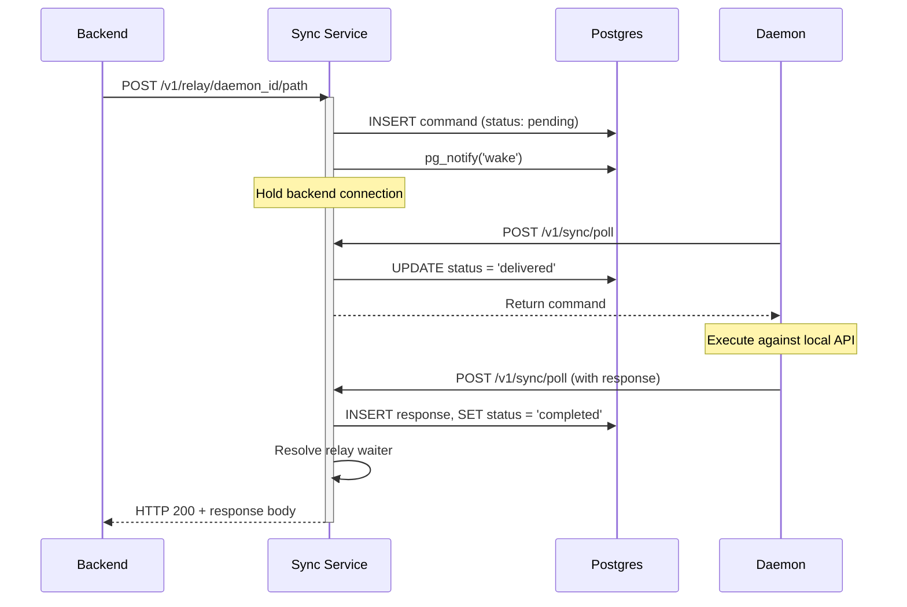
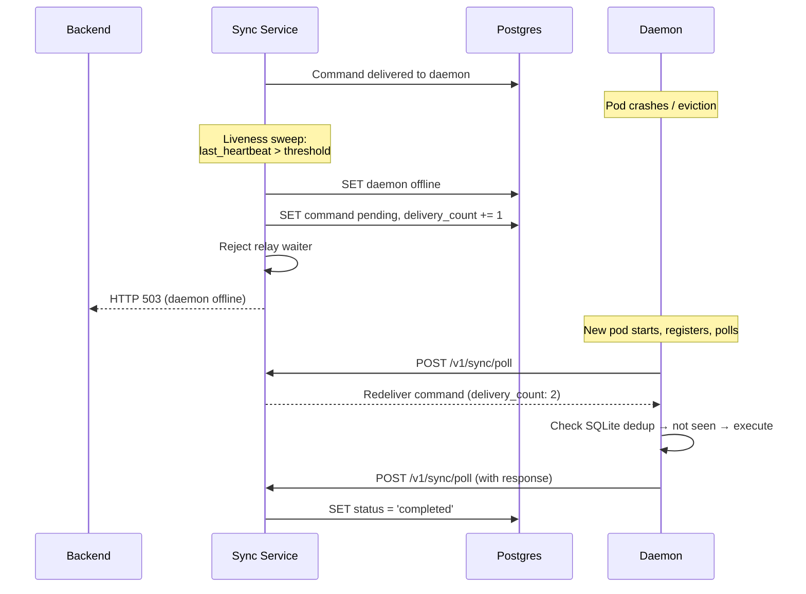
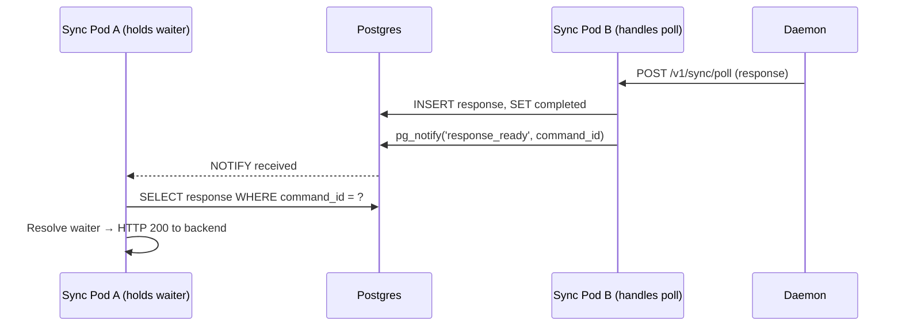

# Sync Service Reliability Hardening

**Status:** Superseded for product scope — see [`DESIGN-control-message-reliability.md`](./DESIGN-control-message-reliability.md)  
**Implementation note:** Phases 1–5 below are largely **shipped** in `services/sync` + daemon command poller. Remaining gaps (Hub-minted `tx_id`, action leases, daemon→Hub outbox, either-side failure) live in the control-message design.  
**Scope (historical):** `services/sync/`, `cliq/daemon/src/core/sync/`  
**Deployment:** Sync service + backend in same K8s cluster. Daemon in Docker/K8s (autonomous teams).

---

## 1. Context

The sync service relays commands between the CliqHub backend and cliq daemons using HTTP long-poll:

```
Backend → POST /v1/relay/:daemon_id/* → queue in Postgres → wake daemon's poll → daemon executes → daemon responds → relay returns to backend
```

The sync service is a **transparent HTTP relay**. It forwards requests and returns responses — same semantics as a direct connection. The daemon runs autonomous teams in Docker/K8s containers.

---

## 2. Invariants

| ID | Guarantee |
|----|-----------|
| I1 | Every command reaches a terminal state (completed, failed, or expired). No command is silently lost. |
| I2 | A command is executed at most once. Redelivery is detected and deduplicated by the daemon. |
| I3 | Every failure is observable. The backend receives an error, or the command transitions to a queryable failed/expired state. |
| I4 | The system self-heals after single-node failures without manual intervention. |

---

## 2.1 Command State Machine



Terminal states: `completed`, `failed`, `expired`. Every command reaches one.

---

## 2.2 Sequence Diagrams

### Happy Path



### Daemon Offline — Redelivery



### Cross-Instance Response



---

## 3. Problems

### P1: Cross-instance response resolution is incomplete

`notify_response_available()` receives the PG NOTIFY but never queries the DB or resolves the waiter.

### P2: No redelivery for unresponded commands

If a daemon pod dies after receiving a command, it stays in `delivered` until TTL expiry. No attempt to redeliver when a new pod comes up.

### P3: `reject_all_for_daemon` is a stub

Deregister and liveness sweep should reject all in-flight waiters immediately. Currently does nothing.

### P4: No failure observability

Expired commands are marked in the DB but nothing surfaces them. The backend has no way to distinguish "still processing" from "silently lost."

### P5: NOTIFY reconnect uses fixed 3s retry

No backoff, no jitter. Can cause connection storms after Postgres recovers.

### P6: No duplicate execution protection

If the daemon pod dies after executing but before delivering the response, redelivery causes the command to execute twice.

---

## 4. Design

### 4.1 Cross-instance response resolution (fixes P1)

When `notify_response_available(command_id)` fires:

1. Look up the waiter in `pending_waiters`.
2. If found, query `sync_command_responses` for that `command_id`.
3. If row exists, resolve the waiter.
4. If not found (commit race), retry once after 200ms. If still missing, let the waiter timeout naturally.

Implementation: inject DB pool into `PollHoldService`, add the query in `notify_response_available`.

### 4.2 Redelivery on daemon offline (fixes P2)

Add columns to `cliq.sync_command_queue`:

| Column | Type | Default |
|--------|------|---------|
| `delivery_count` | INT | 0 |
| `max_deliveries` | INT | 3 |

When the liveness sweep marks a daemon offline:

```sql
UPDATE cliq.sync_command_queue
SET status = 'pending', delivery_count = delivery_count + 1
WHERE daemon_id = $1 AND status = 'delivered' AND delivery_count < max_deliveries
```

Commands that hit `delivery_count >= max_deliveries` transition to `failed`.

When a daemon registers (new pod comes up) and immediately polls, it picks up the requeued commands.

### 4.3 Implement `reject_all_for_daemon` (fixes P3)

```sql
SELECT id FROM cliq.sync_command_queue
WHERE daemon_id = $1 AND status IN ('pending', 'delivered')
```

For each, call `reject_waiter(id, err)`. Called from:
- `RegisterController.deregister`
- `LivenessSweep.sweep` (after marking daemon offline)

### 4.4 Failure observability (fixes P4)

When a command transitions to `failed` or `expired`, the sync service logs it with daemon_id and path. The `/healthz` endpoint exposes:

| Metric | Source |
|--------|--------|
| `failed_commands_24h` | `COUNT(*) WHERE status = 'failed' AND created_at > now - 24h` |
| `expired_commands_24h` | `COUNT(*) WHERE status = 'expired' AND created_at > now - 24h` |

The backend can query command status directly (same cluster, internal service):

```
GET /v1/sync/commands/:command_id/status → { status, delivery_count, created_at }
```

No separate failure notification system needed.

### 4.5 NOTIFY reconnect with backoff (fixes P5)

Replace fixed 3s with:
- Base: 1s, multiplier: 2×, max: 30s, jitter: ±25%
- Reset on successful reconnect

### 4.6 Daemon-side dedup via SQLite (fixes P6)

Add a table to the daemon's existing SQLite database:

```sql
CREATE TABLE IF NOT EXISTS sync_execution_log (
    command_id  TEXT PRIMARY KEY,
    status      TEXT NOT NULL,   -- 'executing' | 'executed'
    started_at  INTEGER NOT NULL,
    response    TEXT,            -- JSON response, set when executed
    expires_at  INTEGER NOT NULL
);
```

Modified `_execute_command` in `command_poller.ts`:

```
async function _execute_command(local_base_url, cmd):
    prior = db.get('SELECT status, response FROM sync_execution_log WHERE command_id = ?', cmd.id)

    if prior.status == 'executed':
        return JSON.parse(prior.response)   // cached — no re-execution

    if prior.status == 'executing':
        return { status_code: 409, body: { error: 'partial_execution' } }

    db.run('INSERT OR REPLACE INTO sync_execution_log VALUES (?, "executing", ?, ?)',
           cmd.id, Date.now(), Date.now() + 90000)

    response = await _do_execute(local_base_url, cmd)

    db.run('UPDATE sync_execution_log SET status = "executed", response = ? WHERE command_id = ?',
           JSON.stringify(response), cmd.id)

    return response
```

Pruning: on daemon boot, delete rows where `expires_at < Date.now()`.

---

## 5. Backend Idempotency Key

Prevents duplicate commands when the backend retries after a relay timeout.

The backend includes an `Idempotency-Key` header. The relay controller checks before queueing:

```sql
SELECT id, status FROM cliq.sync_command_queue
WHERE idempotency_key = $1 AND daemon_id = $2
```

- If found + completed → return cached response from `sync_command_responses`
- If found + in-flight → attach to existing waiter
- If not found → queue new command

Schema:

```sql
ALTER TABLE cliq.sync_command_queue ADD COLUMN IF NOT EXISTS idempotency_key TEXT;

CREATE UNIQUE INDEX IF NOT EXISTS idx_sync_cmd_idempotency
ON cliq.sync_command_queue (daemon_id, idempotency_key)
WHERE idempotency_key IS NOT NULL;
```

---

## 6. K8s Deployment Considerations

### Sync service pods

| Concern | Solution |
|---------|----------|
| LB/ingress timeout | `poll_timeout_ms` (25s) < ingress read timeout (90s). Add annotation: `nginx.ingress.kubernetes.io/proxy-read-timeout: "90"` |
| Graceful shutdown | SIGTERM handler: reject all waiters, release all polls, close server, exit. |
| Readiness probe | `/healthz/ready` returns 503 if NOTIFY connection is down. |

### Daemon pods

| Concern | Solution |
|---------|----------|
| SQLite dedup persistence | Mount volume for `CLIQ_DATA_DIR`. `emptyDir` survives container restarts; PVC survives pod eviction. |
| Egress | Ensure NetworkPolicy allows port 443 to sync service. |
| Rolling deploys | Old pod deregisters (graceful shutdown). New pod registers + polls. Requeued commands are picked up. |

Backend → sync service is internal (ClusterIP). No timeout or network concerns.

---

## 7. Schema Migration

```sql
-- Retry columns
ALTER TABLE cliq.sync_command_queue
    ADD COLUMN IF NOT EXISTS delivery_count INT NOT NULL DEFAULT 0,
    ADD COLUMN IF NOT EXISTS max_deliveries INT NOT NULL DEFAULT 3,
    ADD COLUMN IF NOT EXISTS idempotency_key TEXT;

-- Idempotency dedup index
CREATE UNIQUE INDEX IF NOT EXISTS idx_sync_cmd_idempotency
ON cliq.sync_command_queue (daemon_id, idempotency_key)
WHERE idempotency_key IS NOT NULL;
```

Daemon-side (SQLite, in daemon boot migrations):

```sql
CREATE TABLE IF NOT EXISTS sync_execution_log (
    command_id  TEXT PRIMARY KEY,
    status      TEXT NOT NULL,
    started_at  INTEGER NOT NULL,
    response    TEXT,
    expires_at  INTEGER NOT NULL
);
```

---

## 8. Config Changes

| Env Var | Default | Purpose |
|---------|---------|---------|
| `MAX_DELIVERIES` | 3 | Delivery attempts before `failed` |
| `NOTIFY_RECONNECT_BASE_MS` | 1000 | Base delay for NOTIFY reconnect |
| `NOTIFY_RECONNECT_MAX_MS` | 30000 | Cap on reconnect delay |

---

## 9. Files Changed

| File | Change |
|------|--------|
| `services/sync/src/config/env.ts` | Add `MAX_DELIVERIES`, reconnect config |
| `services/sync/src/db/migrations.ts` | Add `delivery_count`, `max_deliveries`, `idempotency_key` |
| `services/sync/src/services/poll_hold.service.ts` | Inject pool, implement `notify_response_available`, implement `reject_all_for_daemon` |
| `services/sync/src/services/notify.service.ts` | Exponential backoff with jitter |
| `services/sync/src/services/liveness_sweep.ts` | Redelivery logic (reset to pending), `failed` transition |
| `services/sync/src/controllers/relay.controller.ts` | Idempotency-Key check before queueing |
| `services/sync/src/controllers/poll.controller.ts` | Include `delivery_count` in command payload |
| `services/sync/src/controllers/register.controller.ts` | Call `reject_all_for_daemon` on deregister |
| `services/sync/src/controllers/health.controller.ts` | Add failed/expired counts, readiness probe |
| `services/sync/src/server.ts` | SIGTERM handler |
| `cliq/daemon/src/core/sync/command_poller.ts` | SQLite dedup (check before execute, cache response) |
| `cliq/daemon/src/core/store/boot.ts` | Add `sync_execution_log` migration |

---

## 10. Risks

| Risk | Mitigation |
|------|------------|
| SQLite dedup adds I/O to command execution | Single row INSERT/UPDATE, <1ms. SQLite WAL mode. |
| Redelivery causes duplicate execution if SQLite volume not mounted | Application-level idempotency in daemon handlers (check state before acting). Document volume requirement. |
| NOTIFY miss causes cross-instance waiter to timeout | Single 200ms retry covers commit race. Waiter times out after 30s (same as direct-connection timeout). |
| Rolling deploy drops in-flight commands | Graceful shutdown deregisters → requeues. New pod picks up immediately. |

---

## 11. Implementation Plan

### Phase 1: Schema + Foundation

Deploy first. Additive columns, safe under traffic.

| # | Task | File |
|---|------|------|
| 1 | Add `delivery_count`, `max_deliveries`, `idempotency_key` columns | `services/sync/src/db/migrations.ts` |
| 2 | Create idempotency unique index | `services/sync/src/db/migrations.ts` |
| 3 | Add `sync_execution_log` table to daemon SQLite migrations | `cliq/daemon/src/core/store/boot.ts` |

### Phase 2: Sync Service Core

One PR. Fixes P1–P3 (the reliability foundation).

| # | Task | File |
|---|------|------|
| 4 | NOTIFY reconnect with exponential backoff + jitter | `services/sync/src/services/notify.service.ts` |
| 5 | Implement `reject_all_for_daemon` — query commands by daemon_id, reject each waiter | `services/sync/src/services/poll_hold.service.ts` |
| 6 | Cross-instance response resolution — inject pool, query DB in `notify_response_available`, retry once on miss | `services/sync/src/services/poll_hold.service.ts` |
| 7 | Liveness sweep redelivery — reset `delivered` → `pending` (count < max), transition to `failed` (count >= max), call `reject_all_for_daemon` | `services/sync/src/services/liveness_sweep.ts` |
| 8 | Call `reject_all_for_daemon` on deregister | `services/sync/src/controllers/register.controller.ts` |

### Phase 3: Idempotency + Observability

One PR. Depends on Phase 2.

| # | Task | File |
|---|------|------|
| 9 | Idempotency-Key check before queueing (lookup existing, return cached or attach to waiter) | `services/sync/src/controllers/relay.controller.ts` |
| 10 | Include `delivery_count` in command payload to daemon | `services/sync/src/controllers/poll.controller.ts` |
| 11 | Health endpoint: failed/expired counts (24h), readiness probe (NOTIFY connection status) | `services/sync/src/controllers/health.controller.ts` |
| 12 | Add `GET /v1/sync/commands/:id/status` endpoint | `services/sync/src/controllers/relay.controller.ts` |

### Phase 4: K8s Hardening

One PR. Independent — can parallel with Phase 3.

| # | Task | File |
|---|------|------|
| 13 | SIGTERM handler — reject all waiters, release polls, close NOTIFY + pool, exit | `services/sync/src/server.ts` |
| 14 | Readiness probe returns 503 when NOTIFY is disconnected | `services/sync/src/controllers/health.controller.ts` |

### Phase 5: Daemon Dedup

One PR (separate repo). Independent of sync service changes.

| # | Task | File |
|---|------|------|
| 15 | SQLite dedup in `_execute_command` — check before execute, cache response after | `cliq/daemon/src/core/sync/command_poller.ts` |
| 16 | Prune expired dedup rows on boot | `cliq/daemon/src/core/sync/command_poller.ts` |
| 17 | Graceful shutdown — deregister from sync service on SIGTERM | `cliq/daemon/src/core/sync/sync_registration.ts` |

### Dependencies

```
Phase 1 (schema) ─┬─→ Phase 2 (core) ──→ Phase 3 (idempotency)
                   │
                   └─→ Phase 4 (k8s)
                   
Phase 1 (schema) ──→ Phase 5 (daemon dedup)
```

Phase 4 and Phase 5 have no dependency on each other or on Phase 3.

### Rollout

1. Deploy Phase 1 schema migration.
2. Deploy Phase 2 + 4 sync service update. Old daemons unaffected.
3. Deploy Phase 3 sync service update.
4. Deploy Phase 5 daemon update. Old daemons continue working — they just re-execute on redelivery (acceptable during transition).
5. Document volume mount requirement for daemon deployments.
